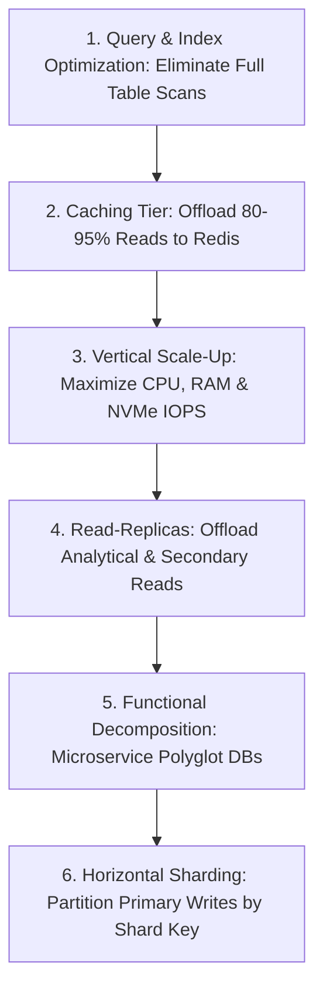
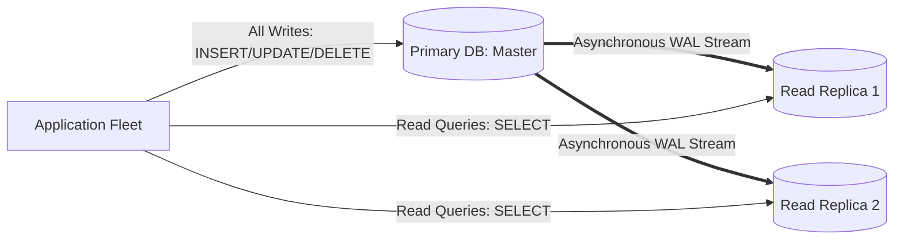

# Database Scaling Architecture

## 1. The Scaling Hierarchy for Persistence Tiers
Scaling relational and distributed databases requires a disciplined progression. Attempting complex distributed sharding before exhausting simpler optimizations introduces catastrophic complexity prematurely.

---

## 2. Read-Replica Topology & Replication Lag

### The Replication Lag Dilemma
Because WAL replication is asynchronous for performance, read replicas lag behind the primary by $\Delta t$ milliseconds:
$$\text{Replication Lag} = t_{\text{replica\_commit}} - t_{\text{primary\_commit}}$$

*Failure Scenario (Write-then-Read)*:
1. User updates shipping address (writes to Primary).
2. Page refreshes immediately; read request routes to Replica 2.
3. Replica 2 has $150\text{ ms}$ lag; user sees their old shipping address!

### Mitigation Strategies
* **Read-Your-Own-Writes Consistency**: Pin the updating user's reads to the Primary database for 5–10 seconds post-mutation.
* **Monotonic Read Routing**: Ensure session affinity routes a specific user to the same replica, preventing time-travel anomalies.
* **GTID / LSN Tracking**: Client tracks the Global Transaction ID (GTID); replica waits until its applied GTID $\ge$ client GTID before serving the read.
