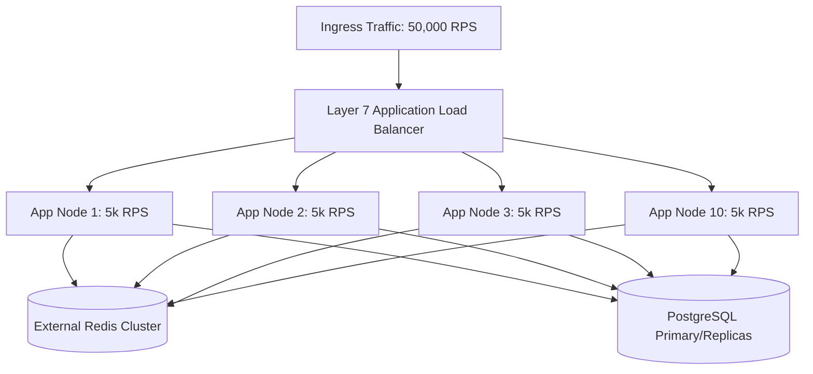

# Horizontal Scaling (Scale-Out)

## 1. Concept & Scope
Horizontal scaling (scale-out) expands system throughput by adding more discrete machine instances (nodes, virtual machines, containers) into a distributed pool, coordinating workloads behind load balancers or partitioned message brokers.

---

## 2. The Architectural Mechanics of Scale-Out

### Core Prerequisites for True Linear Scale-Out
1. **Stateless Compute**: Nodes must not maintain in-memory user session state that binds a client to a specific server.
2. **Shared-Nothing Architecture (SN)**: Nodes operate independently, eliminating distributed locks and inter-node CPU synchronization.
3. **Automated Health Probing**: The load balancer must evict degraded nodes within seconds to prevent blackholing requests.

---

## 3. Mathematical Speedup & Efficiency

### Scale-Out Efficiency Formula
$$E(N) = \frac{\text{Throughput}(N)}{N \times \text{Throughput}(1)} \times 100\%$$
* In an ideal system, $E(N) = 100\%$ (Linear scale).
* In real-world enterprise architectures, network hop latency, connection pooling limits, and downstream database contention reduce efficiency to $80\%\text{--}90\%$.

---

## 4. Trade-offs: Scale-Out vs. Scale-Up

| Architectural Vector | Horizontal Scaling (Scale-Out) | Vertical Scaling (Scale-Up) |
| :--- | :--- | :--- |
| **Scalability Ceiling** | Theoretically infinite ($10^4+$ nodes). | Hard physical ceiling (e.g., 448 vCPUs, 12 TB RAM). |
| **High Availability** | Built-in ($N+1$ or $N+2$ redundancy survives node crashes). | Single point of failure; requires hot standby failover. |
| **System Complexity** | High (distributed tracing, network partitions, service discovery). | Low (single-machine programming model, local memory). |
| **Data Consistency** | Eventual consistency, distributed consensus required. | Strong ACID consistency via local kernel mutexes. |
| **Cost Efficiency** | High OpEx flexibility (scale down to zero during idle). | High fixed cost; hardware underutilized during off-peak. |
