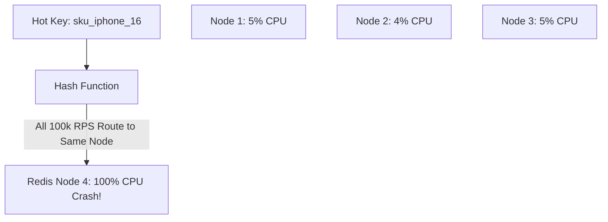

# Hotspot & Thundering Herd Management

## 1. The "Celebrity" / Hot Key Problem
Distributed systems distribute data using hash partitioning or consistent hashing, assuming uniform key distribution. This assumption collapses when a single key attracts astronomical access volume:
* A social media user with $100\text{ Million}$ followers posts an update.
* A flash-sale product SKU receives $100,000\text{ write requests/second}$.
* A single database partition or Redis node burns at $100\%$ CPU while adjacent nodes sit idle.

---

## 2. Hotspot Mitigation Techniques

### 1. Key Salting (Write Splitting)
Append a random suffix between $1$ and $M$ to the hot key on write, splitting traffic across $M$ distinct partitions:
$$\text{Key}_{\text{salted}} = \text{key} + \text{"\_"} + \text{Random}(1, M)$$
* To read the aggregate count (e.g., total likes or inventory), query all $M$ keys in parallel (scatter-gather) and sum the results.

### 2. Multi-Tiered In-Process Caching (L1 / L2 Cache)
Intercept hot keys inside application process memory (L1 Cache: Caffeine / Guava / Go Ristretto) for 2 to 5 seconds.
* $50,000\text{ QPS}$ hitting the microservice fleet is satisfied directly from local JVM memory in $<1\ \mu\text{s}$, completely insulating the distributed Redis cluster and database.

### 3. Mutex Locking / Singleflight (Thundering Herd Protection)
When a high-traffic key expires in Redis, use the **Singleflight / Distributed Lock Pattern** so that only 1 application thread queries the primary database to regenerate the cache, while all other concurrent threads wait for the lock to release.
