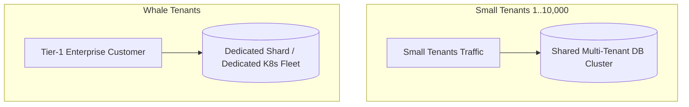

# Large Tenant Scaling (Noisy Neighbor Isolation)

## 1. The Multi-Tenant Imbalance
In B2B enterprise SaaS platforms, tenant size follows an extreme power-law distribution:
* $99\%$ of tenants are small businesses generating $1\text{--}10\text{ RPS}$.
* $1\%$ of tenants are Fortune 500 enterprises generating $50,000\text{ RPS}$ and hundreds of gigabytes of data.

If large and small tenants share the same database tables, connection pools, and worker queues, the large tenant becomes a **Noisy Neighbor**, exhausting system resources and causing outages for small tenants.

---

## 2. Tenant Isolation Architectures

| Architecture Model | Isolation Degree | Blast Radius | Infrastructure Cost | Operational Complexity |
| :--- | :--- | :--- | :--- | :--- |
| **Shared Everything (Pooled)** | Low | High (One tenant crashes DB for all) | Lowest | Low initially; High at scale |
| **Partitioned / Sharded** | Medium | Medium (Limited to single shard) | Moderate | Moderate (Routing proxy required) |
| **Siloed Compute & DB** | Complete | Zero (Completely isolated stack) | Highest | High (Requires fleet automation) |

---

## 3. Dynamic Tenant Migration & Cell-Based Architecture
* **Tenant-Aware Rate Limiting**: Enforce strict Token Bucket rate limits keyed on `tenant_id` at the API Gateway.
* **Zero-Downtime Tenant Shard Migration**: When an enterprise tenant approaches $30\%$ of a shared database shard's total capacity:
  1. Trigger Change Data Capture (CDC) replication from shared shard to a new dedicated shard.
  2. Sync data deltas continuously.
  3. Update tenant routing table at API Gateway during a $100\text{ ms}$ quiet window.
