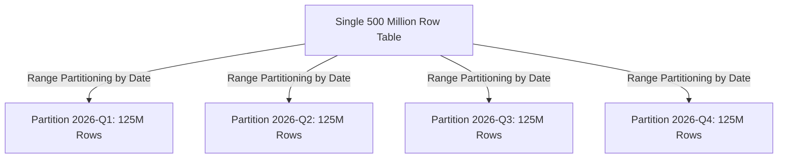

# Partition-Based Scaling Architecture

## 1. Concept: Partitioning vs. Sharding
While often used interchangeably in casual discussion:
* **Partitioning**: The logical division of a single database's data into distinct subsets (e.g., PostgreSQL table partitioning by month).
* **Sharding**: The physical distribution of partitions across multiple independent database instances/servers across a network.

---

## 2. Partitioning Strategies

### 1. Range Partitioning
* Divides data based on predefined ranges (e.g., `created_at BETWEEN '2026-01-01' AND '2026-03-31'`).
* **Advantage**: Instant historical purging (`DROP TABLE partition_2024_q1` executes in milliseconds without WAL bloat).
* **Hazard**: Hotspotting—all current writes hit the newest partition exclusively.

### 2. Hash Partitioning
* Computes `Hash(key) % Number_of_Partitions`.
* **Advantage**: Perfectly uniform distribution across partitions; eliminates write hotspots.
* **Hazard**: Inefficient range scans; querying a date range requires querying all partitions (scatter-gather).

### 3. List / Geographical Partitioning
* Partitions data based on explicit lists of values (e.g., `country_code IN ('US', 'CA')`, `country_code IN ('DE', 'FR', 'GB')`).
* **Advantage**: Enforces strict data sovereignty and GDPR compliance boundaries at the physical storage level.

---

## 3. Partition Pruning
Partition pruning is the query optimizer optimization where the database engine analyzes the `WHERE` clause and skips scanning partitions that cannot possibly contain matching rows:
$$\text{Query Execution Time} \propto \frac{\text{Total Rows}}{\text{Number of Partitions Pruned}}$$
