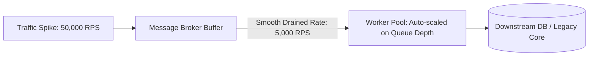

# Queue-Based Scaling Architecture

## 1. Asynchronous Traffic Leveling
Queue-based scaling decouples high-frequency producers from variable-capacity consumer worker fleets. By introducing a persistent message broker (Apache Kafka, RabbitMQ, Amazon SQS), the system absorbs sudden, violent traffic spikes without crashing downstream databases or third-party APIs.

---

## 2. Autoscaling Workers on Queue Depth (KEDA Pattern)
Scaling worker pods on CPU utilization is flawed for message queues: if downstream I/O blocks, worker CPU drops to near zero while queue backlog explodes.

### Modern Queue-Driven Autoscaling
Autoscale worker fleets dynamically using **Queue Depth (Consumer Lag)**:
$$\text{Desired Worker Pods} = \left\lceil \frac{\text{Current Queue Backlog}}{\text{Target Backlog per Worker}} \right\rceil$$

If total unconsumed messages in the broker = $200,000$, and each worker is calibrated to process $1,000$ messages per minute:
$$\text{Desired Workers} = \left\lceil \frac{200,000}{1,000} \right\rceil = 200\text{ worker pods}$$

---

## 3. Backpressure & Poison Message Isolation
* **Dead Letter Queues (DLQ)**: When a worker crashes or encounters an unparseable payload, the message must not be re-queued indefinitely (blocking the partition). After 3–5 failed attempts, route the message to a DLQ for manual SRE inspection.
* **Flow Control / Backpressure**: If downstream databases experience elevated latency, workers throttle consumption by pausing message fetches (`consumer.pause()`), preventing memory exhaustion.
