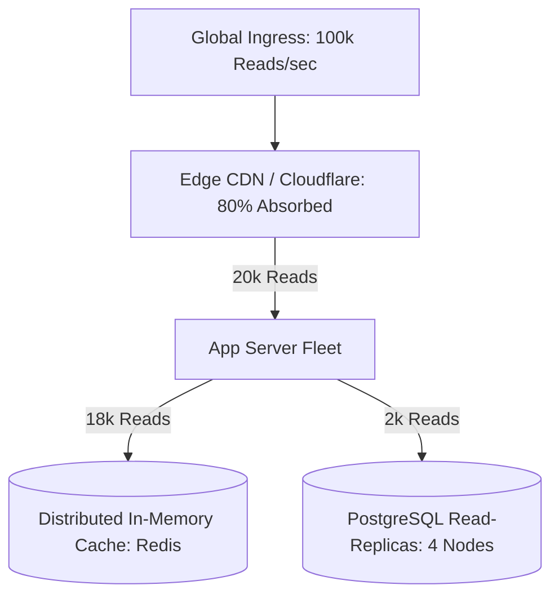
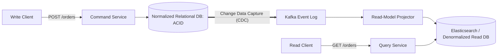

# Read Scaling Architecture

## 1. Principles of Asymmetric Read Scaling
In the vast majority of web, social, and e-commerce platforms, read operations outnumber write operations by orders of magnitude ($100:1$ to $1000:1$). Read scaling optimizes this asymmetric access pattern by decoupling read query execution from write persistence.

---

## 2. The Read Scaling Hierarchy
1. **Edge Caching (CDN)**: Caches static media, HTML responses, and public REST endpoints at geographic Points of Presence (PoPs), eliminating origin compute entirely.
2. **Reverse Proxy Caching (Varnish / Nginx)**: In-memory HTTP acceleration sitting in front of web application gateways.
3. **Application In-Memory Caching (Redis / Memcached)**: Caches serialized JSON objects, database query results, and session tokens with sub-millisecond retrieval.
4. **Relational Read-Replicas**: Offloads heavy search, reporting, and non-critical analytical queries from the write master.
5. **CQRS (Command Query Responsibility Segregation)**: Maintains separate, optimized data models for writes (normalized 3NF relational) and reads (denormalized Elasticsearch / Document store).

---

## 3. CQRS & Materialized Views Pattern

*Architectural Impact*: Reads bypass complex SQL table joins; queries execute against pre-computed JSON documents in Elasticsearch or Redis in $<5\text{ ms}$.
