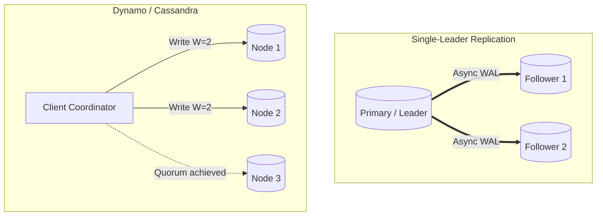

# Database & State Replication Architecture

## 1. Objectives of Distributed Replication
Replication copies data across multiple physically distinct machines connected via a network. It serves two primary architectural goals:
1. **High Availability & Fault Tolerance**: System survives node, rack, or datacenter crashes.
2. **Read Scalability**: Distributes read query traffic across replica pools.

---

## 2. Replication Topologies

---

## 3. Synchronous vs. Asynchronous Replication

| Dimension | Synchronous Replication | Asynchronous Replication | Semi-Synchronous (PostgreSQL/MySQL) |
| :--- | :--- | :--- | :--- |
| **Durability (RPO)** | Zero data loss ($\text{RPO} = 0$). | Non-zero risk ($\text{RPO} > 0$ equal to lag). | Zero data loss if 1 replica survives. |
| **Write Latency** | High (bounded by slowest replica network RTT). | Low ($<1\text{ ms}$; acknowledges immediately on master). | Balanced (acknowledges once 1 replica flushes). |
| **Availability** | Lower (master blocks writes if replica unreachable). | High (master continues writes even if replicas die). | High (falls back to async if replica times out). |

---

## 4. Quorum Consensus in Leaderless Replication

In leaderless architectures (Cassandra, Amazon DynamoDB), consistency is configured mathematically per transaction:
$$R + W > N$$
Where:
* $N$ = Total replication factor
* $W$ = Number of replicas that must acknowledge a write before success
* $R$ = Number of replicas that must respond to a read query

*Strong Consistency Guarantee*: If $R + W > N$, the read set and write set must overlap by at least one node, guaranteeing that the reader will observe the latest version (via vector clocks or timestamps).
