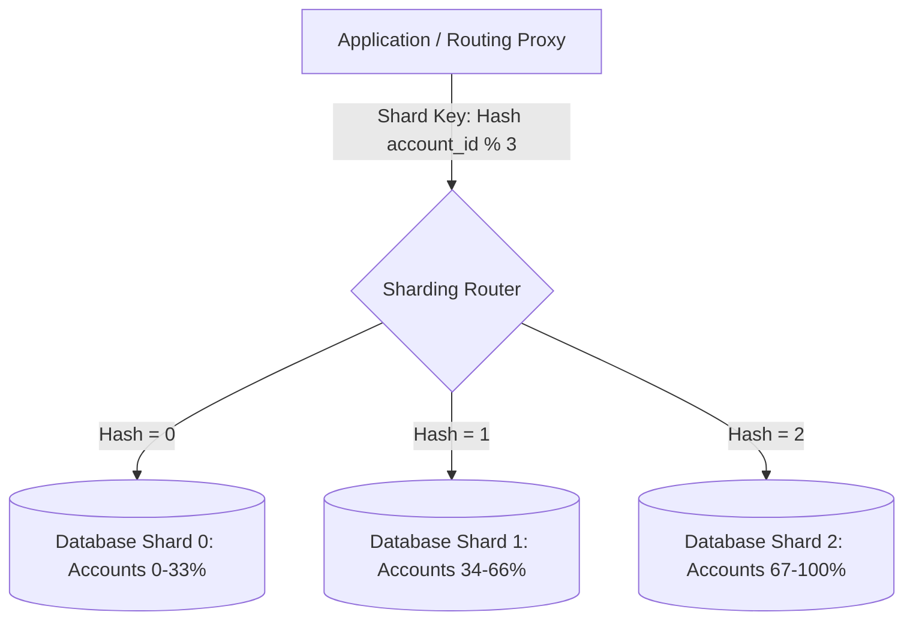
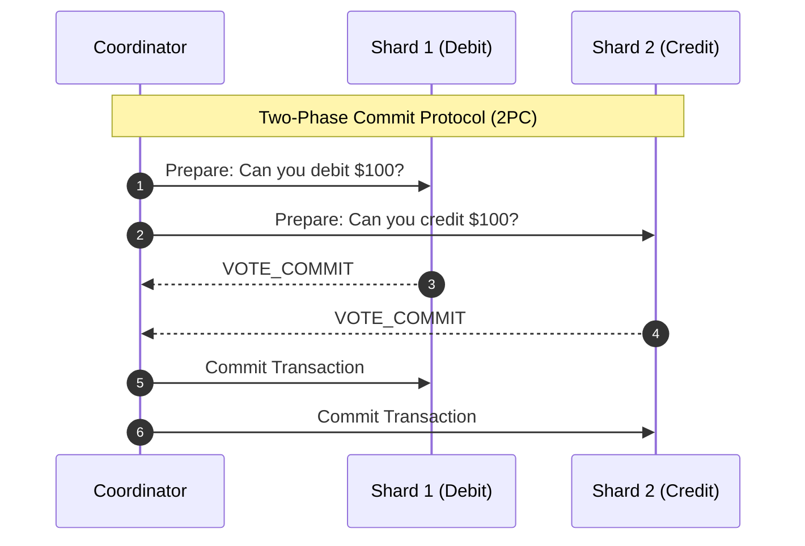

# Database Sharding Architecture

## 1. Principles of Horizontal Database Sharding
Sharding is the ultimate relational scaling mechanism. When a database exhausts all vertical scaling options (e.g., $128\text{ vCPU}$, $1\text{ TB RAM}$, $64,000\text{ IOPS}$), the dataset is partitioned across $N$ physically independent database clusters.

---

## 2. Selecting the Shard Key: The Critical Architectural Decision
The choice of Shard Key is irreversible without complete database migration. A flawed shard key introduces catastrophic cross-shard queries and unbalanced hotspots.

### Evaluation Criteria
1. **High Cardinality**: Keys like `tenant_id`, `user_id`, or `uuid` provide millions of distinct values. Low cardinality keys (`status`, `gender`) fail immediately.
2. **Uniform Distribution**: Ensures data volume and write transactions distribute evenly across all physical shards.
3. **Query Co-location**: All tables frequently joined together must share the same shard key. In an e-commerce platform, partitioning both `orders` and `order_items` by `customer_id` guarantees joins execute locally on a single shard.

---

## 3. Cross-Shard Distributed Transactions
When a business operation touches multiple shards (e.g., transferring money from User A on Shard 1 to User B on Shard 2), traditional single-node ACID transactions cannot be used.

*Architectural Cost of 2PC*: Two-Phase Commit introduces distributed lock holding, synchronous network round-trips, and vulnerability to coordinator crashes. **Modern best practice replaces 2PC with asynchronous Saga patterns (Orchestrated or Choreographed events)**.
