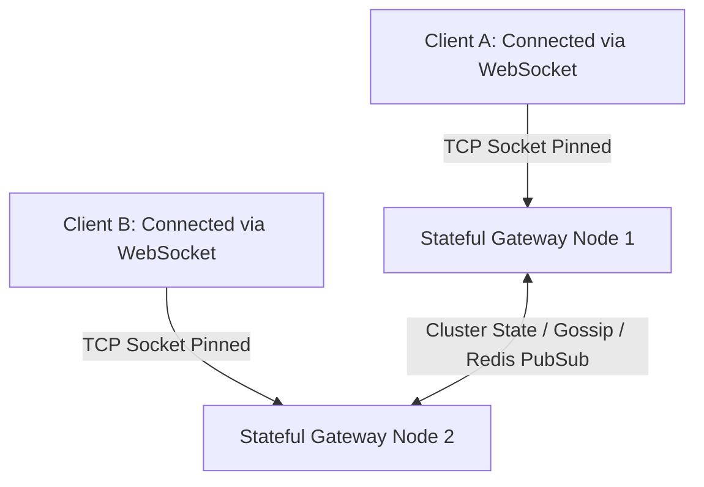

# Stateful Service Architecture

## 1. When Stateful Services Are Unavoidable
While stateless compute simplifies scaling, many core enterprise systems are inherently **stateful**:
* **Databases & Persistent Stores**: PostgreSQL, MySQL, Cassandra, MongoDB.
* **Distributed Message Brokers**: Apache Kafka, RabbitMQ, Apache Pulsar.
* **Real-Time Interactive Fabrics**: WebSockets, online multiplayer game servers, collaborative document editors (Google Docs / Figma CRDT engines).
* **Distributed In-Memory Caches**: Redis, Memcached, Hazelcast.

---

## 2. Scaling Challenges of Stateful Systems
1. **Connection Pinning**: Long-lived TCP/WebSocket connections bind client sockets to a specific physical server instance. Autoscaling cannot simply terminate a node without severing thousands of active sessions.
2. **Data Locality & Partitioning**: State must be partitioned across nodes using consistent hashing. Rebalancing partitions during scale-out requires transferring gigabytes of state across the network.
3. **Ordered Event Processing**: Processing financial ledgers requires strict sequence ordering per account, requiring all events for `account_id=X` to route to the exact same partition/actor instance.

---

## 3. Stateful Architectural Patterns

### 1. Consistent Hashing with Virtual Nodes
Used by DynamoDB, Cassandra, and distributed caches to distribute stateful keys across a dynamic cluster while minimizing key re-mappings during node additions or removals:
$$\text{Keys Re-mapped on Node Join/Leave} = \frac{K}{N}$$
Where $K$ is total keys and $N$ is total nodes.

### 2. Distributed Virtual Actor Model (Akka / Microsoft Orleans)
Actors represent stateful entities (e.g., a single user or shopping cart) loaded into memory on-demand. The actor runtime handles location transparency, clustering, and automatic passivation to persistent storage when idle.

### 3. Kubernetes StatefulSets
StatefulSets provide stable network identities (`pod-0`, `pod-1`), persistent volume attachment across pod restarts, and strictly ordered rolling updates.
