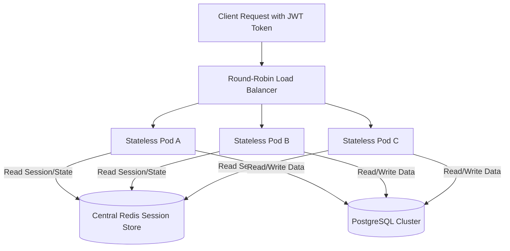

# Stateless Service Architecture

## 1. Defining Statelessness in System Design
A service is **stateless** if it retains no client session context, transaction history, or persistent state in its local process memory or local filesystem between successive client requests. Any server instance in the fleet can service any incoming request with identical correctness.

---

## 2. Where Does State Live in a "Stateless" Architecture?
State cannot be destroyed; it is merely externalized into specialized state-management tiers:

| State Type | Legacy Anti-Pattern | Modern Cloud-Native Pattern |
| :--- | :--- | :--- |
| **User Authentication** | In-Memory HTTP Session (`HttpSession`) | Cryptographic Self-Contained JWT or Redis-backed Session ID |
| **Shopping Cart / Drafts** | Server Local Memory | In-Memory Redis Hash or NoSQL Document Store |
| **Uploaded User Files** | Local Disk (`/var/uploads/`) | Cloud Object Store (S3/GCS) with Pre-signed URLs |
| **Long-Running Job Status** | In-Process Background Thread | Distributed Queue (Kafka/SQS) + Persistent Job Database |

---

## 3. Architectural Advantages of Statelessness
* **Instant Elastic Scaling**: Horizontal Pod Autoscalers (HPA) can scale compute instances from 10 to 500 pods in response to CPU surges without migrating in-flight user sessions.
* **Chaos Resilience**: If a stateless pod crashes or the underlying Kubernetes node terminates, the load balancer immediately re-routes the user's next request to an adjacent pod with zero session loss.
* **Blue/Green & Canary Deployments**: Rolling updates can terminate and replace 25% of the fleet incrementally without breaking active user workflows.
