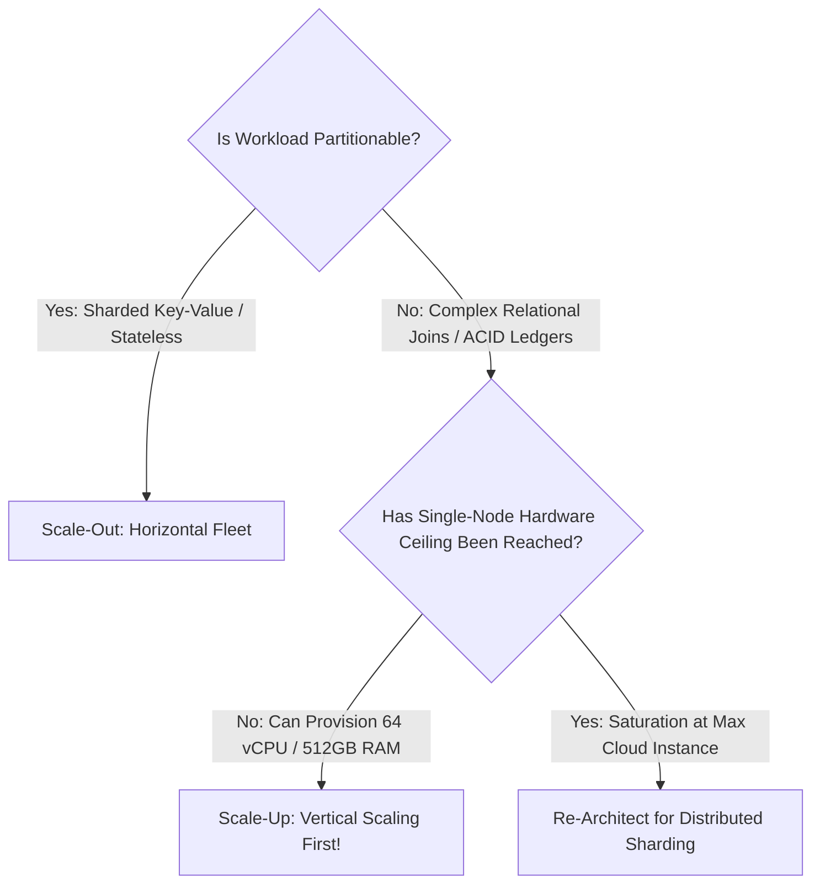

# Vertical Scaling (Scale-Up)

## 1. Role in Enterprise Architecture
Vertical scaling (scale-up) increases system capacity by upgrading existing hardware resources on a single node: provisioning higher clock-speed CPUs, adding RAM channels, upgrading network interface cards (NICs), or attaching higher-IOPS NVMe solid-state storage.

---

## 2. When to Choose Vertical Scaling
While modern cloud marketing heavily favors microservices and horizontal scaling, vertical scaling remains the **preferred first-line architecture** for specific enterprise workloads:

1. **Complex Relational Transactions**: Enterprise ERP/CRM ledgers requiring cross-table relational integrity (`FOREIGN KEY` constraints, multi-table joins, sub-millisecond ACID transactions).
2. **Early-Stage Systems & Startups**: Eliminating distributed systems overhead (distributed tracing, network splits, eventual consistency bugs) maximizes developer velocity.
3. **Ultra-Low Latency In-Memory Compute**: Processing trading orders or high-frequency analytics within single-node CPU L3 caches and shared memory channels avoids network serialization overhead.

---

## 3. The Physical Limits of Vertical Scaling

### The Hardware Ceiling Matrix
* **CPU Ceiling**: Modern public cloud instances max out at $\approx 448\text{ vCPUs}$ (e.g., AWS `u-24tb1.metal`).
* **Memory Ceiling**: Maximum physical RAM tops out at $24\text{ TB}$.
* **Disk IOPS Ceiling**: Cloud block storage (AWS EBS io2) caps at $256,000\text{ IOPS}$ and $4,000\text{ MB/s}$ throughput.
* **Cost Non-Linearity**: Sizing up hardware exhibits super-linear pricing. Upgrading from a 32-core node to a 128-core node often costs $6\times\text{--}8\times$ more due to enterprise NUMA architecture premiums.

---

## 4. Downtime Implications & Modern Mitigations
Historically, vertical scaling required service downtime to shut down, resize, and boot the virtual machine.
* **Live VM Migration**: Hypervisors (VMware ESXi, KVM) support live migration of running workloads.
* **Read-Replica Promotion**: Spin up a larger replica, catch up replication stream, execute a zero-downtime controlled failover switch in $<5\text{ seconds}$.
