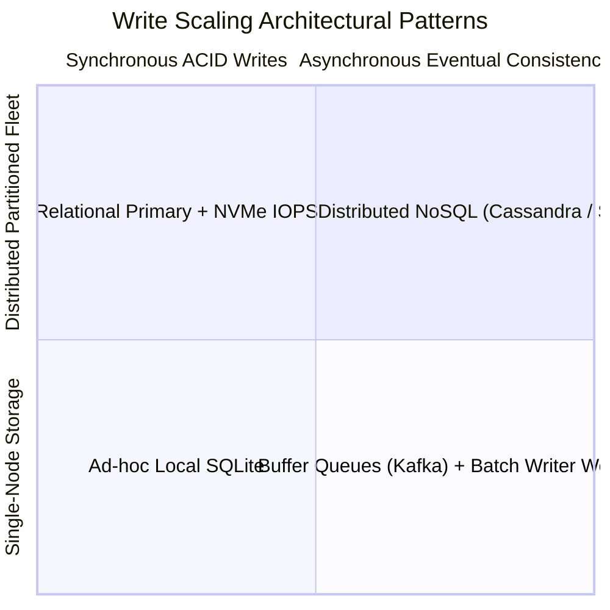

# Write Scaling Architecture

## 1. The Write Bottleneck Challenge
Unlike reads—which can be replicated infinitely across read-only nodes—writes require strict coordination:
* Acquiring exclusive row/table locks.
* Modifying multiple secondary B-Tree indexes.
* Flushing synchronous Write-Ahead Logs (WAL) to durable disk.
* Enforcing unique constraints and foreign keys.

---

## 2. Core Architectural Patterns for Write Scaling

### 1. Asynchronous Write Buffering (Queue-Based Leveling)
Instead of executing synchronous database writes on the HTTP request thread, the API writes a light event to Kafka or SQS in $<2\text{ ms}$. Dedicated worker pools consume the queue and execute bulk batched database inserts:
$$\text{Single-Row Insert IOPS} \gg \text{Batched Insert IOPS (1000 rows/statement)}$$

### 2. LSM-Trees (Log-Structured Merge Trees)
Datastores like Apache Cassandra, RocksDB, and ScyllaDB replace random disk writes with sequential append-only writes:
1. Write appended to sequential disk Write-Ahead Log (WAL).
2. Data inserted into in-memory sorted tree (Memtable).
3. Client receives success acknowledgement immediately ($<1\text{ ms}$).
4. Memtables flushed to immutable disk files (SSTables) in background batch threads.

### 3. Conflict-Free Replicated Data Types (CRDTs)
For active-active multi-region writes where cross-region network latency precludes synchronous locks, CRDTs enable concurrent writes across regions that automatically converge without data loss.
