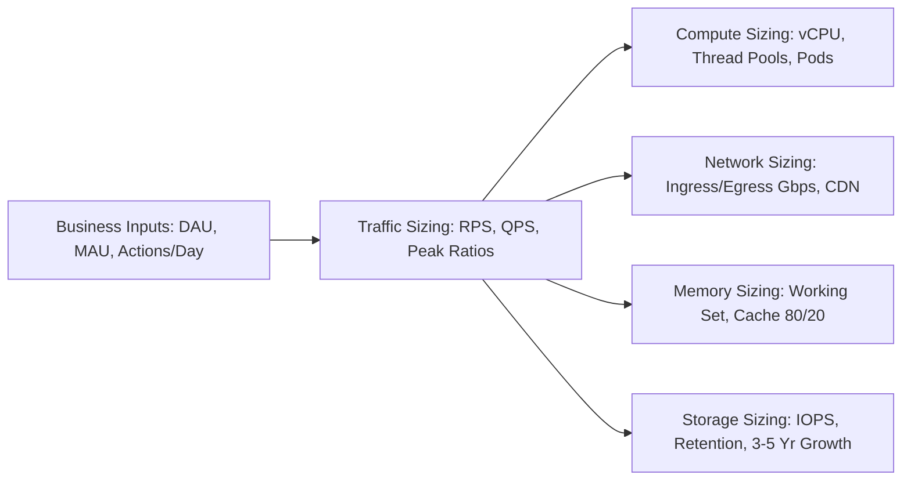

# Scale Estimation

## 1. Overview & Architecture Philosophy
Scale estimation is the quantitative discipline of translating high-level business metrics (Daily Active Users, transactions per day, catalog items) into precise hardware, network, memory, and database requirements. In enterprise and Fortune 500 systems, scale estimation is the difference between an infrastructure architecture that scales smoothly with sub-linear cost growth and one that crashes under launch-day load or hemorrhages capital through over-provisioning.

---

## 2. Universal Constants & Reference Numbers

### Time Conversions
* $1\text{ Day} = 24 \times 3600 = 86,400\text{ seconds} \approx 10^5\text{ seconds}$ (Mental shorthand: $\times 10^5$)
* $1\text{ Million requests / day} \approx 12\text{ RPS}$ (Average)
* $10\text{ Million requests / day} \approx 116\text{ RPS}$ (Average)
* $100\text{ Million requests / day} \approx 1,160\text{ RPS}$ (Average)
* $1\text{ Billion requests / day} \approx 11,600\text{ RPS}$ (Average)

### Data Size Shorthand (Powers of 2 vs 10)
* $1\text{ KB} = 10^3\text{ bytes} \approx 2^{10}\text{ bytes}$
* $1\text{ MB} = 10^6\text{ bytes} \approx 2^{20}\text{ bytes}$
* $1\text{ GB} = 10^9\text{ bytes} \approx 2^{30}\text{ bytes}$
* $1\text{ TB} = 10^{12}\text{ bytes} \approx 2^{40}\text{ bytes}$
* $1\text{ PB} = 10^{15}\text{ bytes} \approx 2^{50}\text{ bytes}$

### Latency Numbers Every Solutions Architect Must Know (Jeff Dean's Baseline)
| Operation | Typical Latency | Human-Scale Perspective (1 ns = 1 sec) |
| :--- | :--- | :--- |
| **L1 CPU Cache Reference** | $0.5\text{ ns}$ | $0.5\text{ seconds}$ |
| **Branch Mispredict** | $5\text{ ns}$ | $5\text{ seconds}$ |
| **L2 CPU Cache Reference** | $7\text{ ns}$ | $7\text{ seconds}$ |
| **Mutex Lock / Unlock** | $25\text{ ns}$ | $25\text{ seconds}$ |
| **Main Memory Reference (RAM)** | $100\text{ ns}$ | $1.7\text{ minutes}$ |
| **Compress 1KB with Zstandard** | $2,000\text{ ns} = 2\ \mu\text{s}$ | $33\text{ minutes}$ |
| **Read 1 MB sequentially from Memory** | $3,000\text{ ns} = 3\ \mu\text{s}$ | $50\text{ minutes}$ |
| **NVMe SSD Random Read** | $10\text{--}50\ \mu\text{s}$ | $3.5\text{--}14\text{ hours}$ |
| **Round trip within same Datacenter (LAN)** | $500\ \mu\text{s} = 0.5\text{ ms}$ | $5.8\text{ days}$ |
| **Read 1 MB sequentially from NVMe SSD** | $250\ \mu\text{s} = 0.25\text{ ms}$ | $2.9\text{ days}$ |
| **HDD Seek (Rotational Disk)** | $10,000\ \mu\text{s} = 10\text{ ms}$ | $4\text{ months}$ |
| **Read 1 MB sequentially from HDD** | $20,000\ \mu\text{s} = 20\text{ ms}$ | $8\text{ months}$ |
| **Send packet CA to Netherlands and back** | $150,000\ \mu\text{s} = 150\text{ ms}$ | $4.8\text{ years}$ |

---

## 3. Core Sizing Formulas

### Request Rate
$$\text{RPS}_{\text{avg}} = \frac{\text{Daily Active Users (DAU)} \times \text{Requests per User per Day}}{86,400}$$
$$\text{RPS}_{\text{peak}} = \text{RPS}_{\text{avg}} \times \text{Peak-to-Average Ratio (PAR)}$$

### Bandwidth
$$\text{Bandwidth}_{\text{Ingress}} = \text{RPS}_{\text{write}} \times \text{Payload Size}_{\text{write}} \times 8\text{ bits/byte}$$
$$\text{Bandwidth}_{\text{Egress}} = \text{RPS}_{\text{read}} \times \text{Payload Size}_{\text{read}} \times 8\text{ bits/byte}$$

### Storage Growth (Multi-Year)
$$\text{Storage}_{\text{raw}} = \text{Daily Ingestion} \times 365 \times \text{Retention Years}$$
$$\text{Storage}_{\text{effective}} = \text{Storage}_{\text{raw}} \times \text{Replication Factor (RF)} \times (1 + \text{Index Overhead}) \times (1 + \text{Buffer Margin})$$

---

## 4. Directory Structure
This folder provides exhaustive, mathematically rigorous guides for each dimension of scale estimation:
* [Traffic Estimation](traffic-estimation.md)
* [Request Rate Estimation](request-rate-estimation.md)
* [Peak Traffic Estimation](peak-traffic-estimation.md)
* [Storage Estimation](storage-estimation.md)
* [Bandwidth Estimation](bandwidth-estimation.md)
* [Concurrent Users](concurrent-users.md)
* [Read-Write Ratio](read-write-ratio.md)
* [Cache Capacity](cache-capacity.md)
* [Database Capacity](database-capacity.md)
* [Queue Capacity](queue-capacity.md)
* [Retention Estimation](retention-estimation.md)
* [Growth Projection](growth-projection.md)
* [Capacity Safety Margin](capacity-safety-margin.md)
* [Back of Envelope Calculations](back-of-envelope-calculations.md)
