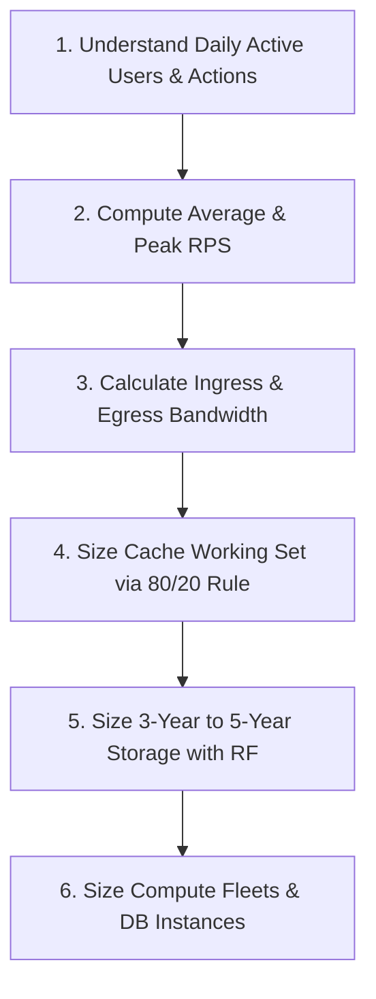

# Back-of-the-Envelope Calculations Cheatsheet

## 1. Master System Design Cheat Sheet

### Golden Rules of Thumb
* **Seconds in a day**: $86,400 \approx 10^5\text{ seconds}$
* **$1\text{ Million requests / day}$** $\approx 12\text{ RPS}$
* **$10\text{ Million requests / day}$** $\approx 116\text{ RPS}$
* **$100\text{ Million requests / day}$** $\approx 1,160\text{ RPS}$
* **$1\text{ Billion requests / day}$** $\approx 11,600\text{ RPS}$
* **Peak Traffic Multiplier**: Assume $2\times\text{--}3\times$ average for normal consumer web; $5\times\text{--}10\times$ for flash events.

### Standard Server Hardware Throughput Capacities
| Node Type / Service | Typical Capacity Range | Limiting Bottleneck |
| :--- | :--- | :--- |
| **API Gateway (Nginx / Envoy)** | $25,000\text{--}50,000\text{ RPS}$ per 8-core host | CPU, Network socket limits |
| **Stateless Microservice (Go / Rust)** | $10,000\text{--}25,000\text{ RPS}$ per 8-core host | CPU, JSON serialization |
| **Stateless Microservice (Java / C#)** | $4,000\text{--}12,000\text{ RPS}$ per 8-core host | Memory, GC pauses |
| **Stateless Microservice (Node / Python)** | $1,000\text{--}3,000\text{ RPS}$ per 8-core host | Single-threaded event loop |
| **Redis Cache (Single Core)** | $50,000\text{--}100,000\text{ Operations/sec}$ | Single-thread CPU core, Network |
| **PostgreSQL / MySQL (Primary Write)** | $2,000\text{--}5,000\text{ Transactions/sec}$ | Disk IOPS, WAL sync, Row locks |
| **Apache Kafka (Per Broker Node)** | $50\text{--}100\text{ MB/s}$ Ingress write | Disk sequential write, Network NIC |

---

## 2. Step-by-Step System Sizing Blueprint

---

## 3. Worked End-to-End System Design: Global URL Shortener (e.g., TinyURL / Bit.ly)

### 1. Requirements & Business Inputs
* **New URLs Created**: 100 Million URLs per month.
* **Read-to-Write Ratio**: $100:1$ ($100$ redirects per 1 short URL created).
* **URL Lifespan**: URLs retained for 5 years.
* **Payload**: Original URL ($500\text{ bytes}$), Short Code ($7\text{ bytes}$), Timestamp ($8\text{ bytes}$), User ID ($16\text{ bytes}$). Total row $\approx 550\text{ bytes} \approx 0.5\text{ KB}$.

---

### 2. Request Rates (QPS)
* **Write Requests**:
  $$\text{Writes / Month} = 100\text{ Million}$$
  $$\text{Writes / Sec (Avg)} = \frac{100,000,000}{30 \times 86,400} \approx \frac{10^8}{2.6 \times 10^6} \approx 38.5\text{ writes/sec}$$
  $$\text{Writes / Sec (Peak, } 2\times\text{)} \approx 77\text{ writes/sec}$$

* **Read Requests ($100:1$ ratio)**:
  $$\text{Reads / Sec (Avg)} = 38.5 \times 100 = 3,850\text{ reads/sec}$$
  $$\text{Reads / Sec (Peak, } 2\times\text{)} = 3,850 \times 2 = 7,700\text{ reads/sec}$$

---

### 3. Bandwidth Sizing
* **Ingress Bandwidth (Writes)**:
  $$\text{BW}_{\text{ingress}} = 77\text{ writes/sec} \times 550\text{ bytes} \times 8 \approx 338.8\text{ Kbps} \quad (\text{Negligible})$$
* **Egress Bandwidth (Reads)**:
  $$\text{BW}_{\text{egress}} = 7,700\text{ reads/sec} \times 550\text{ bytes} \times 8 \approx 33.88\text{ Mbps} \quad (\approx 4.2\text{ MB/s})$$

---

### 4. Storage Sizing (5 Years)
* **Total URLs in 5 Years**:
  $$N_{\text{total}} = 100\text{ Million/month} \times 12 \times 5 = 6\text{ Billion URLs}$$
* **Raw 5-Year Storage**:
  $$\text{Storage}_{\text{raw}} = 6 \times 10^9 \times 550\text{ bytes} \approx 3.3\text{ TB}$$
* **Effective Storage (Accounting for B-Tree indexes, RF=3, 30% Headroom)**:
  $$\text{Storage}_{\text{effective}} = 3.3\text{ TB} \times 1.35\text{ (Index)} \times 3\text{ (RF)} \times 1.30\text{ (Slack)} \approx 17.4\text{ TB}$$

---

### 5. In-Memory Cache Sizing (Redis)
Applying the **80/20 Rule**: Cache top $20\%$ of daily read requests.
* **Daily Reads**: $3,850 \times 86,400 \approx 332.6\text{ Million reads/day}$.
* **Working Set Objects ($20\%$)**:
  $$\text{Cached Items} = 332.6 \times 10^6 \times 0.20 \approx 66.5\text{ Million items}$$
* **Cache RAM Needed**:
  $$\text{Raw RAM} = 66.5 \times 10^6 \times 550\text{ bytes} \approx 36.6\text{ GB}$$
* Adding Redis Memory Overhead ($1.4\times$):
  $$\text{Target Cache Fleet RAM} = 36.6\text{ GB} \times 1.4 \approx 51.2\text{ GB RAM}$$
  *Architecture*: A 3-node Redis cluster with 32 GB RAM per node comfortably accommodates the working set with HA replication.
