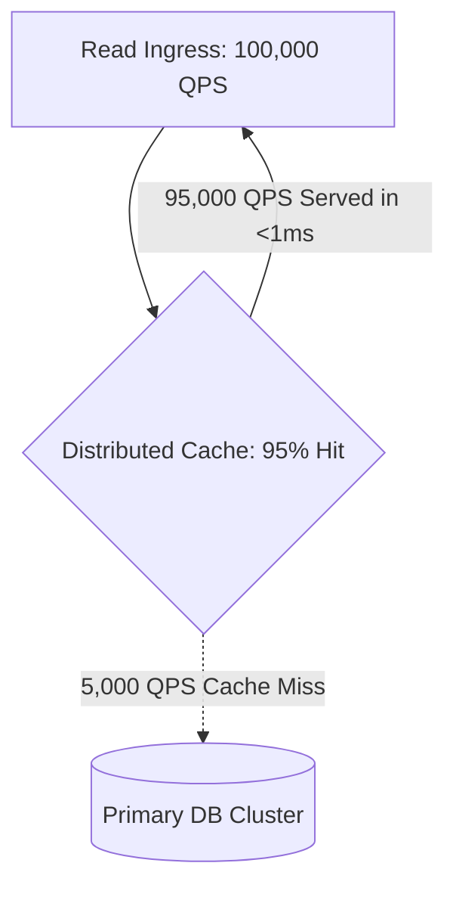

# Cache Capacity Estimation

## 1. Principles of Cache Sizing: The 80/20 Pareto Rule
In high-throughput systems, caching shields persistence tiers from collapse. A fundamental rule of thumb in scale estimation is the **Pareto Principle (80/20 Rule)**: approximately $20\%$ of unique data objects generate $80\%$ of total read traffic. Caching this "working set" in ultra-fast in-memory stores (Redis, Memcached) dramatically reduces database load and lowers latency from milliseconds to microseconds.

---

## 2. Mathematical Cache Sizing Model

### Working Set Memory Calculation
$$\text{Memory}_{\text{raw}} = N_{\text{unique\_daily\_items}} \times P_{\text{working\_set}} \times S_{\text{item}}$$
Where:
* $N_{\text{unique\_daily\_items}}$ = Total unique items accessed per day
* $P_{\text{working\_set}}$ = Working set fraction (typically $0.20$)
* $S_{\text{item}}$ = Average item size in bytes

### Effective Cache Memory (Accounting for Engine Overhead)
In-memory engines like Redis allocate internal data structures (`robj`, dict entries, pointer overhead, and memory allocator fragmentation from `jemalloc`). In practice, raw payload data must be scaled by an **Engine Overhead Factor** ($M_{\text{overhead}} \approx 1.35\text{--}1.50$):

$$\text{Memory}_{\text{cluster}} = \text{Memory}_{\text{raw}} \times M_{\text{overhead}} \times \text{RF}_{\text{replica}} \times (1 + M_{\text{headroom}})$$

---

## 3. Effective Latency & Hit Ratio Formulas

### Average System Latency
$$T_{\text{effective}} = (H \times T_{\text{cache}}) + ((1 - H) \times T_{\text{db}})$$
Where:
* $H$ = Cache Hit Ratio ($0.0 \le H \le 1.0$)
* $T_{\text{cache}}$ = Cache read latency (e.g., $1.0\text{ ms}$)
* $T_{\text{db}}$ = Database read latency (e.g., $30.0\text{ ms}$)

#### Impact of Hit Ratio on Database Load:
If total ingress read traffic is $100,000\text{ QPS}$:
* At $90\%$ Hit Ratio: Database absorbs $10,000\text{ QPS}$.
* At $99\%$ Hit Ratio: Database absorbs $1,000\text{ QPS}$ ($10\times$ load reduction!).
* If the cache drops to $80\%$ Hit Ratio: Database absorbs $20,000\text{ QPS}$ ($2\times$ spike on DB).

---

## 4. Worked Enterprise Sizing: News / Social Media Feed

### Sizing Parameters
* **Daily Unique Articles Viewed**: $10,000,000$ articles.
* **Average Article Metadata & Teaser Payload**: $2\text{ KB}$ ($2,048\text{ bytes}$).
* **Target Working Set**: Top $20\%$ of daily articles.
* **Engine**: Redis Cluster (1 Primary + 1 Replica per shard).
* **Memory Safety Headroom**: $25\%$ buffer to prevent out-of-memory (OOM) evictions during traffic surges.

### Calculation
$$\text{Cached Objects} = 10,000,000 \times 0.20 = 2,000,000\text{ items}$$
$$\text{Raw Payload} = 2,000,000 \times 2\text{ KB} = 4,000,000\text{ KB} \approx 4\text{ GB}$$
Applying Redis Engine Overhead ($1.4\times$):
$$\text{Memory}_{\text{primary}} = 4\text{ GB} \times 1.4 = 5.6\text{ GB}$$
Adding Replica ($\text{RF} = 2$) and Headroom ($1.25\times$):
$$\text{Total Cluster RAM} = 5.6\text{ GB} \times 2 \times 1.25 = 14.0\text{ GB RAM}$$

*Deployment Topology*: Sized across an HA Redis cluster with 3 shards (each running master + replica on $8\text{ GB}$ nodes).

---

## 5. Eviction Policies & Production Gotchas
* **Eviction Algorithms**:
  * `allkeys-lru`: Evicts least recently used keys among all keys (ideal for working-set caching).
  * `allkeys-lfu`: Evicts least frequently used keys (ideal when older popular items must stay hot).
  * `volatile-ttl`: Evicts keys with shortest TTL remaining.
* **The "Cache Stampede" Risk**: When a high-traffic key expires simultaneously across all threads, hundreds of parallel requests hit the database at once. Mitigate via probabilistic early expiration (XFetch algorithm) or distributed mutex locks.
