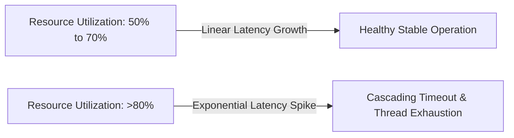

# Capacity Safety Margin & Headroom

## 1. Principles of Architectural Headroom
Operating hardware or distributed clusters near $100\%$ capacity is fatal in production. According to classical Queueing Theory ($M/M/1$ and $M/M/c$ models), as system resource utilization exceeds $70\%\text{--}80\%$, wait times and queue lengths do not increase linearly—they explode asymptotically toward infinity.

---

## 2. Queueing Theory & The Knee of the Curve

### Kingman's Formula for Waiting Time ($W_q$)
$$W_q \approx \left( \frac{\rho}{1 - \rho} \right) \times \left( \frac{C_a^2 + C_s^2}{2} \right) \times \tau$$
Where:
* $\rho$ = Resource utilization factor ($0 \le \rho < 1$)
* $\tau$ = Service time
* $C_a, C_s$ = Coefficients of variation for arrivals and service times

As utilization ($\rho$) approaches $1.0$:
$$\lim_{\rho \to 1} \frac{\rho}{1 - \rho} = \infty$$

*Rule of Thumb*: Sizing systems for **$\le 65\%$ peak utilization** ensures minor traffic surges do not push the architecture past the knee of the latency curve into brownout failure.

---

## 3. Redundancy & Failure Headroom Models

### 1. N+1 Redundancy
The cluster has 1 extra node beyond the minimum required ($N$) to absorb a single instance crash without violating SLOs.
$$\text{Provisioned Nodes} = N + 1$$
*Failure Risk*: If 1 node crashes during peak load, remaining nodes operate at $100\%$ capacity. If a second node fails, cascading cluster failure occurs.

### 2. N+2 Redundancy
The cluster survives 2 simultaneous node crashes (e.g., during rolling OS patching when a random hardware failure occurs).
$$\text{Provisioned Nodes} = N + 2$$

### 3. 2N Redundancy (Active-Active Multi-DC / Multi-Region)
Both data centers or regions are sized to handle $100\%$ of total global traffic independently.
$$\text{Provisioned Nodes} = 2 \times N$$
*Utilization*: In steady state, both regions operate at $\le 50\%$ utilization. If Region A goes dark completely, Region B absorbs $100\%$ load at safe $100\%$ capacity.

---

## 4. Recommended Utilization Ceilings by Subsystem

| Subsystem / Resource | Recommended Max Target | Safe Headroom Buffer | Failure Consequence if Breached |
| :--- | :--- | :--- | :--- |
| **Compute / CPU Fleet** | $60\%\text{--}65\%$ | $35\%\text{--}40\%$ | Severe CPU throttling, thread starvation, p99 latency spikes. |
| **Application Memory (RAM)** | $70\%$ | $30\%$ | Linux kernel OOM-killer randomly terminating worker pods. |
| **Database Disk IOPS** | $60\%$ | $40\%$ | Disk queue saturation, SQL lock timeouts, replication lag spikes. |
| **Disk Storage Volume** | $75\%$ | $25\%$ | Database crashes into read-only mode, LSM compaction freezes. |
| **Network NIC Bandwidth** | $50\%\text{--}60\%$ | $40\%$ | TCP packet drops, synthetic retransmissions, connection drops. |
