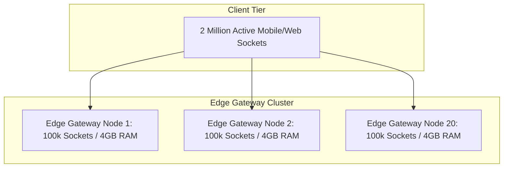

# Concurrent Users

## 1. Concurrency vs. Throughput: Little's Law
A frequent error in scale estimation is confusing total registered users, Daily Active Users (DAU), and **Concurrent Users**. 
* **Registered Users**: Total accounts in the database.
* **Active Users (DAU)**: Users who open the app at least once during a 24-hour period.
* **Concurrent Users ($L$)**: Users actively holding a connection or executing a transaction at any single millisecond.

The fundamental law governing concurrency is **Little's Law**:
$$L = \lambda \times W$$
Where:
* $L$ = Average number of concurrent requests/users in the system
* $\lambda$ = Arrival rate of incoming requests (RPS)
* $W$ = Average response time (residence time) per request in seconds

---

## 2. Worked Mathematical Examples

### Scenario A: Stateless REST API
* **Arrival Rate ($\lambda$)**: $20,000\text{ RPS}$
* **Average Latency ($W$)**: $150\text{ ms} = 0.15\text{ seconds}$
$$L = 20,000 \times 0.15 = 3,000\text{ active concurrent requests}$$
*Architecture Implication*: The application tier must maintain 3,000 active execution threads/coroutines concurrently across its fleet.

### Scenario B: Stateful Real-Time WebSocket Connection Fleet
* **Connected Users**: $2,000,000\text{ concurrent users holding open WebSockets}$
* **Ping / Heartbeat Rate**: 1 heartbeat every 30 seconds per user
$$\lambda_{\text{heartbeat}} = \frac{2,000,000}{30} \approx 66,666\text{ RPS}$$
* **WebSocket Memory Footprint**: Each open socket allocates Linux kernel buffers (`rmem`, `wmem`) + application session state ($\approx 25\text{ KB per connection}$).
$$\text{Memory Required for Connections} = 2,000,000 \times 25\text{ KB} = 50,000,000\text{ KB} \approx 50\text{ GB RAM}$$

---

## 3. Operating System & Networking Limits

### The C10M Challenge (Concurrency Constraints)
1. **File Descriptor Limits**: In Linux, every TCP socket is a file descriptor. The default limit is often 1,024 (`ulimit -n`). High-concurrency servers must tune `nofile` to $1,048,576$.
2. **Ephemeral Port Exhaustion**: When an API gateway proxies connections to an upstream pool using a single IP, it can allocate at most $\approx 60,000$ ephemeral ports (`ip_local_port_range`). Mitigate via connection pooling or multiple virtual IPs.
3. **Thread-per-Connection vs. Event-Driven Epoll**:
   * *Thread-per-request (Legacy Apache/Tomcat)*: 1,000 threads consume 1GB+ stack RAM and induce high OS context switching.
   * *Non-blocking Event Loops (Netty, Nginx, Go, Rust)*: Leverage `epoll`/`kqueue` to manage 100,000+ idle sockets per process with minimal CPU overhead.
