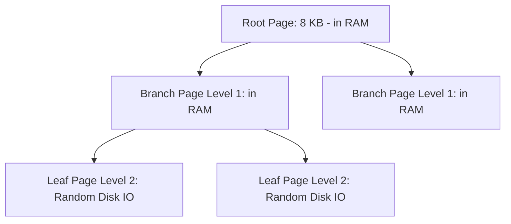

# Database Capacity Planning

## 1. Core Dimensions of Database Capacity
Database sizing requires balancing three distinct hardware constraints:
1. **IOPS Capacity**: Number of discrete read/write operations the underlying storage subsystem can sustain per second.
2. **I/O Throughput**: Maximum data transfer rate (MB/s) between compute and disk.
3. **Storage Volume**: Raw disk gigabytes/terabytes including B-Tree indexes, WAL, and MVCC versions.

---

## 2. IOPS & Throughput Mathematical Modeling

### IOPS Demand Calculation
$$\text{IOPS}_{\text{total}} = \text{IOPS}_{\text{read}} + \text{IOPS}_{\text{write}}$$
$$\text{IOPS}_{\text{read}} = \text{QPS}_{\text{db\_read}} \times \left(1 - \text{Buffer Pool Hit Ratio}\right) \times P_{\text{pages\_per\_query}}$$
$$\text{IOPS}_{\text{write}} = \text{QPS}_{\text{write}} \times \left(1 + N_{\text{indexes}} + \text{WAL Amplification}\right)$$

Where:
* **Buffer Pool Hit Ratio**: Fraction of reads satisfied by database memory RAM (target: $>95\%$).
* **Write IOPS Amplification**: In relational databases, writing 1 row modifies the table heap, each secondary B-Tree index, and appends to the Write-Ahead Log (WAL).

---

## 3. B-Tree Index Depth & Fan-out Mechanics

### B-Tree Branching Factor Formula
$$B = \frac{\text{Page Size}}{\text{Key Size} + \text{Pointer Size}}$$
For an $8\text{ KB}$ ($8,192\text{ bytes}$) page with a 16-byte UUID key + 8-byte child pointer ($24\text{ bytes}$):
$$B \approx \frac{8,192}{24} \approx 341\text{ pointers per node}$$

### Maximum Rows at Tree Depth ($D$)
$$N_{\text{max}} = B^D$$
* Depth 1 (Root only): 341 rows
* Depth 2 (Root + Leaves): $341^2 \approx 116,281$ rows
* Depth 3 (Root + 1 Branch + Leaves): $341^3 \approx 39,651,821$ rows ($\approx 40\text{ Million}$)
* Depth 4 (Root + 2 Branch + Leaves): $341^4 \approx 13.5\text{ Billion}$ rows

*Takeaway*: When a table exceeds 40M rows, random index lookups traverse 4 disk pages. If intermediate levels fall out of the buffer pool, read IOPS explodes.

---

## 4. Connection Pool Sizing: The Universal PostgreSQL / HikariCP Formula

A dangerous operational mistake is provisioning thousands of open database connections. Database threads contend for CPU cores, memory channels, and disk locks.

### The Canonical Sizing Formula
$$\text{Max Pool Connections} = (\text{Core Count} \times 2) + \text{Effective Spindle Count}$$
* For an 8-core database server with fast NVMe SSD storage:
$$\text{Connections} = (8 \times 2) + 1 = 17\text{ connections}$$
* A tiny pool of 16 to 32 connections routinely delivers **higher throughput** and **lower p99 latency** than an unconstrained pool of 2,000 connections thrashing OS context switches.

---

## 5. Sharding Threshold Calculator
When a single database node exceeds any of the following hardware ceilings, sharding is required:
* **Storage Limit**: $> 4\text{ TB}$ per single instance (backup/restore and maintenance operations become unwieldy).
* **Write IOPS Ceiling**: Sustained writes exceed $25,000\text{ IOPS}$ on cloud NVMe storage.
* **Network Egress**: Database network interface exceeds $80\%$ of NIC saturation.
