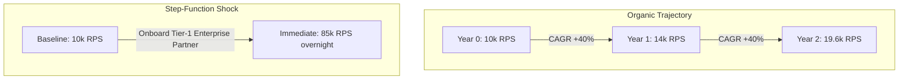
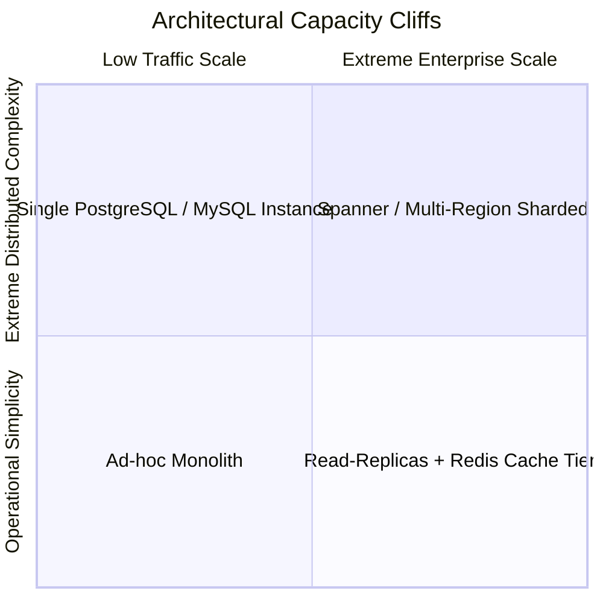

# Growth Projection

## 1. Organic vs. Step-Function Growth Modeling
Capacity planning that assumes linear growth fails in modern digital enterprises. Growth typically manifests across two distinct vectors:
1. **Organic Compound Growth**: Steady user adoption modeled via Compound Annual Growth Rate (CAGR).
2. **Step-Function Ingestion**: Abrupt, vertical volume jumps triggered by enterprise customer onboarding, geographic market launches, or corporate acquisitions.

---

## 2. Mathematical Models for Capacity Projections

### Compound Growth Equation
$$C_t = C_0 \times (1 + r)^t$$
Where:
* $C_0$ = Current capacity / traffic demand
* $r$ = Annual growth rate (CAGR)
* $t$ = Planning horizon in years

### Doubling Time (The Rule of 72)
$$t_{\text{double}} \approx \frac{72}{r_{\%}}$$
* At $25\%$ annual growth: Capacity doubles in $\approx 2.9\text{ years}$.
* At $50\%$ annual growth: Capacity doubles in $\approx 1.4\text{ years}$.
* At $100\%$ annual growth: Capacity doubles every $8.6\text{ months}$.

---

## 3. The "Capacity Cliff" Phenomenon
As systems scale along a growth curve, they encounter architectural non-linearities known as **Capacity Cliffs**:

* **Cliff 1 (At ~5,000 QPS)**: Single relational database CPU saturates. *Remedy*: Introduce Redis caching tier + Read Replicas.
* **Cliff 2 (At ~25,000 Write QPS)**: Primary database write IOPS maxes out. *Remedy*: Application-level sharding or migration to distributed NoSQL/Spanner.
* **Cliff 3 (At ~100,000 QPS)**: Single cloud VPC networking limits and NAT gateway bandwidth bottlenecks hit hard limits. *Remedy*: Multi-VPC, multi-region routing.

---

## 4. Multi-Year Sizing Horizon Matrix (3-Year Example)

| Architectural Vector | Baseline (Year 0) | Year 1 (+50% CAGR) | Year 2 (+50% CAGR) | Year 3 (+50% CAGR) | Architectural Threshold Trigger |
| :--- | :--- | :--- | :--- | :--- | :--- |
| **Peak Traffic** | $10,000\text{ RPS}$ | $15,000\text{ RPS}$ | $22,500\text{ RPS}$ | $33,750\text{ RPS}$ | Migrate to event-driven queueing |
| **Daily Ingress Data** | $500\text{ GB/day}$ | $750\text{ GB/day}$ | $1.12\text{ TB/day}$ | $1.68\text{ TB/day}$ | Implement columnar cold storage |
| **Cumulative Storage** | $182\text{ TB}$ | $455\text{ TB}$ | $864\text{ TB}$ | $1,477\text{ TB}$ | Sharding required on operational DB |
| **Compute vCPUs** | 256 vCPUs | 384 vCPUs | 576 vCPUs | 864 vCPUs | Kubernetes multi-cluster federation |
