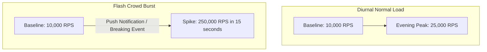
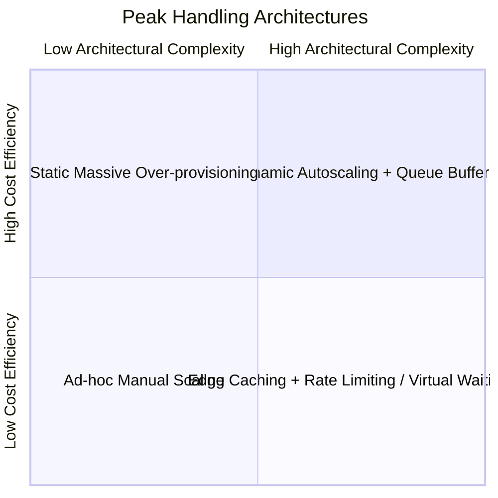

# Peak Traffic Estimation

## 1. Nature of Real-World Traffic Peaks
Systems rarely operate under uniform average load. Traffic follows cyclical diurnal patterns, sudden flash crowds, scheduled promotional events (Flash Sales, Black Friday), or breaking news events. Sizing a system for average load results in catastrophic launch-day outages.

---

## 2. Mathematical Models for Peak Multipliers

### Peak-to-Average Ratio (PAR)
$$\text{PAR} = \frac{\text{Traffic}_{\text{peak}}}{\text{Traffic}_{\text{avg}}}$$

### Typical Industry Peak Ratios
| Workload Profile | Typical PAR | Drivers |
| :--- | :--- | :--- |
| **Global Enterprise B2B SaaS** | $1.5\text{--}2.0\times$ | Spread across global business hours. |
| **Regional Consumer Social/Streaming** | $2.5\text{--}4.0\times$ | Sharp evening consumption (7 PM - 11 PM). |
| **E-Commerce Flash Sale / Ticket Drop** | $10\text{--}50\times$ | Millions arriving within the exact same minute. |
| **Payment Gateway (Cyber Monday)** | $5\text{--}8\times$ | Concentrated checkout bursts. |
| **Tax Filing System (Deadline Day)** | $20\text{--}100\times$ | Extreme artificial deadline compression. |

---

## 3. Flash Crowd & Burst Modeling

### The 80/20 Peak Distribution Rule
A common heuristic is that $80\%$ of daily transactions occur within $20\%$ of the operational hours:

$$\text{RPS}_{\text{busy\_window}} = \frac{0.80 \times Q_{\text{day}}}{0.20 \times 86,400} = \frac{0.80 \times Q_{\text{day}}}{17,280} \approx 4 \times \text{RPS}_{\text{avg}}$$

---

## 4. Mitigating Peak Loads: Architectural Strategies

1. **Virtual Waiting Rooms (Queue-it Pattern)**:
   For extreme $50\times$ flash drops (e.g., concert tickets), intercept traffic at the CDN edge and throttle admissions to origin services at a steady, mathematically safe ingestion rate.
2. **Asynchronous Queue Buffering**:
   Absorb massive write bursts into distributed logs (Kafka/AWS Kinesis) capable of absorbing high ingress throughput, allowing downstream worker pools to consume and write to databases at a controlled, sustainable rate.
3. **Aggressive Dynamic TTL Reduction**:
   During peak traffic spikes, dynamically drop cache TTLs on high-traffic read endpoints from 5 minutes to 30 seconds. Even a 30-second TTL shields the database from $95\%$ of repeated queries.
