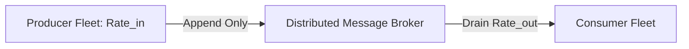

# Queue Capacity Planning

## 1. Role of Queues in Scale & Asynchrony
Message brokers and distributed logs (Apache Kafka, RabbitMQ, AWS SQS, Apache Pulsar) decouple high-throughput producers from variable-speed consumer fleets. Queue capacity planning calculates the disk throughput, memory buffering, partition count, and retention storage necessary to withstand sustained downstream outages without data loss.

---

## 2. Sizing Models & Ingress Throughput

### Broker Throughput Equation
$$\text{Throughput}_{\text{ingress}} = \text{Events/Sec} \times \text{Average Event Size (bytes)}$$
$$\text{Disk Write Throughput} = \text{Throughput}_{\text{ingress}} \times \text{Replication Factor (RF)}$$

---

## 3. Backlog Accumulation Under Downstream Outage

When consumer services crash or third-party payment processors experience downtime, the broker accumulates messages in disk buffers.

### Outage Backlog Sizing Formula
$$\text{Backlog Volume (bytes)} = \text{Rate}_{\text{in}} \times S_{\text{msg}} \times T_{\text{outage}}$$
Where:
* $T_{\text{outage}}$ = Maximum anticipated recovery window (e.g., 24 hours of outage)

### Catch-up Time After Recovery
Once consumers recover, they must process both incoming live traffic ($\text{Rate}_{\text{in}}$) and the accumulated backlog:
$$T_{\text{catch-up}} = \frac{\text{Accumulated Backlog Messages}}{\text{Consumer Fleet Max Rate} - \text{Live Ingress Rate}}$$

---

## 4. Worked Enterprise Example: Financial Ledger Event Stream

### Sizing Parameters
* **Normal Production Ingress**: $25,000\text{ events/sec}$.
* **Average Event Size**: $2\text{ KB}$ ($2,048\text{ bytes}$).
* **Retention Window**: 7 days (for audit and playback).
* **Replication Factor**: $\text{RF} = 3$ (strict durability).
* **Peak Surge Multiplier**: $2.0\times$ ($50,000\text{ events/sec}$ peak).

### Calculations

#### 1. Peak Ingress Throughput
$$\text{Throughput}_{\text{ingress, peak}} = 50,000 \times 2,048\text{ bytes} \approx 102.4\text{ MB/s}$$

#### 2. Peak Cluster Disk Write Rate (with $\text{RF} = 3$)
$$\text{Disk Write Rate} = 102.4\text{ MB/s} \times 3 \approx 307.2\text{ MB/s}$$

#### 3. 7-Day Storage Requirement
$$\text{Daily Raw Data} = 25,000\text{ avg/s} \times 2,048\text{ bytes} \times 86,400\text{ s} \approx 4.42\text{ TB/day}$$
$$\text{7-Day Effective Storage} = 4.42\text{ TB/day} \times 7\text{ days} \times 3\text{ (RF)} \times 1.25\text{ (Index/Compaction buffer)} \approx 116\text{ TB}$$

#### 4. Kafka Partition Sizing
A single Kafka partition reliably handles $\approx 10\text{ MB/s}$ write throughput:
$$\text{Minimum Partitions} = \frac{102.4\text{ MB/s}}{10\text{ MB/s}} \approx 11\text{ partitions}$$
*Recommendation*: Provision **32 partitions** across 6 brokers to support 3-year growth and horizontal consumer thread parallelism.

---

## 5. Consumer Lag & Poison Pill Mitigations
* **Dead Letter Queues (DLQ)**: Malformed or unprocessable payloads must route to a DLQ after $N$ failed retry attempts (e.g., 3 retries with backoff). A single unhandled exception must never block partition offsets.
* **Disk Saturation Protection**: Message brokers must enforce strict TTL eviction or quota limits to prevent 100% disk utilization from freezing the broker OS.
