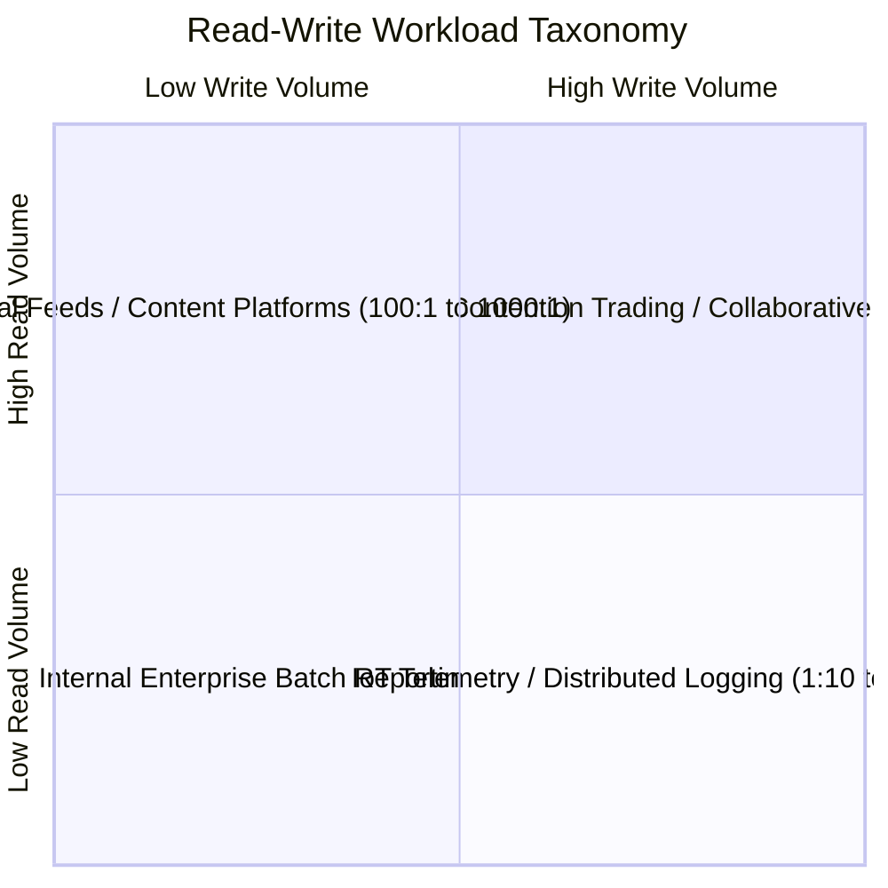
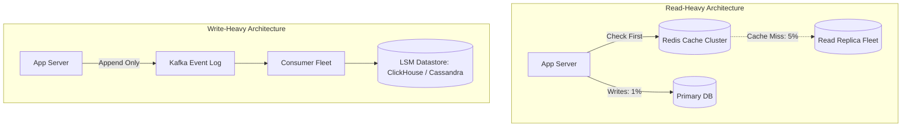

# Read-Write Ratio

## 1. System Classification by Access Pattern
The ratio of read operations to write operations is the most influential parameter in persistence and caching architecture. Distributed data systems exhibit fundamentally different scaling paths depending on whether the workload is read-dominated, write-dominated, or balanced.

---

## 2. Quantitative Comparison of Profiles

| Metric / Dimension | Read-Heavy ($100:1$ to $1000:1$) | Balanced ($1:1$ to $5:1$) | Write-Heavy ($1:10$ to $1:50$) |
| :--- | :--- | :--- | :--- |
| **Typical Systems** | Twitter/X, News sites, E-Commerce | Uber matching, Financial ledgers | IoT Telemetry, Log aggregation, Metrics |
| **Optimal Datastore** | Relational DB + In-Memory Caches | Relational with Sharding or Spanner | LSM-Tree NoSQL (Cassandra, RocksDB, ClickHouse) |
| **Primary Bottleneck** | Read latency, Cache hit ratio | Lock contention, ACID isolation | Disk write IOPS, Network ingress, Compaction |
| **Scaling Mechanism** | Read-replicas, Edge CDN caching | Database sharding, Two-Phase Commit | Append-only logs, Kafka partitioning |

---

## 3. Architectural Implications for Storage Engines

### B-Tree vs. LSM-Tree Mechanics
* **B-Trees (PostgreSQL, MySQL, Oracle)**:
  * Optimized for **Fast Reads** ($O(\log N)$ disk page access).
  * Writes require in-place page updates and random disk I/O, bounded by IOPS limits.
* **LSM-Trees (Log-Structured Merge Trees - Cassandra, ScyllaDB, Kafka)**:
  * Optimized for **Ultra-Fast Writes** ($O(1)$ sequential append to memory Memtable and WAL).
  * Reads require checking bloom filters, memtables, and multiple SSTables, incurring read amplification.

---

## 4. Consistency Dilemmas in Read-Heavy Architectures
In read-heavy architectures scaled via asynchronous read replicas:
* **Replication Lag**: A user updates their profile (Write to Primary) and immediately refreshes the page (Read from Replica). If replica lag is $200\text{ ms}$, the user sees their old profile.
* **Architectural Remedies**:
  * *Read-Your-Own-Writes (RYOW) Consistency*: Route reads for the updating user to the primary database for 5 seconds post-update; route other users to replicas.
  * *Session Sticky Routing*: Pin user session reads to an in-sync replica.
