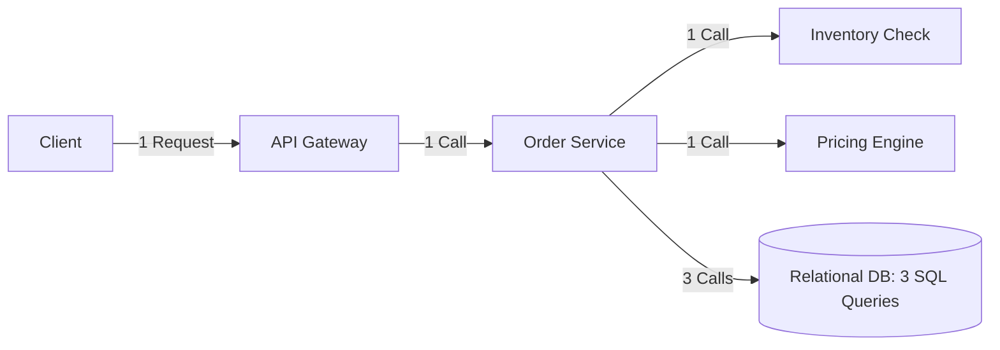

# Request Rate Estimation

## 1. Purpose & Analytical Foundations
Request rate estimation models the exact transactions-per-second (TPS) or queries-per-second (QPS) arriving at specific application endpoints. Accurately decoupling read request rates from write request rates is essential because reads and writes scale across radically different architectural boundaries.

---

## 2. Mathematical Models

### General Request Rate Equation
$$\text{QPS}_{\text{service}} = \sum_{k=1}^{m} (\text{Traffic}_{\text{endpoint}_k} \times A_k)$$
Where $A_k$ is the **Fan-out Amplification Factor** for endpoint $k$.

### Request Amplification Matrix
When an external client invokes an endpoint, downstream microservices experience an amplified query rate:

$$\text{Downstream QPS} = \text{Upstream QPS} \times \text{Fan-out Factor}$$

---

## 3. Read vs. Write Rate Decomposition

### Read QPS
$$\text{QPS}_{\text{read}} = \text{QPS}_{\text{total}} \times \left(\frac{R}{R + W}\right)$$

### Write QPS
$$\text{QPS}_{\text{write}} = \text{QPS}_{\text{total}} \times \left(\frac{W}{R + W}\right)$$

### Worked Sizing: High-Volume Social Timeline Service
* **Total Daily Transactions**: 5 Billion requests/day.
* **Average QPS**: $\frac{5 \times 10^9}{86,400} \approx 57,870\text{ QPS}$.
* **Peak QPS ($\text{PAR} = 3.0$)**: $173,610\text{ QPS}$.
* **Read-to-Write Ratio**: $100:1$ ($99\%$ reads, $1\%$ writes).

#### Calculation:
$$\text{QPS}_{\text{read, peak}} = 173,610 \times 0.99 = 171,874\text{ QPS}$$
$$\text{QPS}_{\text{write, peak}} = 173,610 \times 0.01 = 1,736\text{ QPS}$$

---

## 4. Compute Node Sizing from Request Rate

To size the web/app server fleet, evaluate the concurrency per CPU core:

$$\text{Throughput per Core} = \frac{1}{\text{Execution Time per Request (seconds)}} \times \text{Concurrency Factor}$$

If an average API request takes $25\text{ ms}$ ($0.025\text{ s}$) of CPU processing time:
$$\text{Capacity per vCPU} = \frac{1}{0.025} = 40\text{ RPS per core}$$

Targeting a safe $60\%$ CPU utilization threshold:
$$\text{Safe RPS per Core} = 40 \times 0.60 = 24\text{ RPS per vCPU}$$

To sustain peak read load of $171,874\text{ QPS}$:
$$\text{Required vCPUs} = \frac{171,874}{24} \approx 7,161\text{ vCPUs}$$
Using 16-vCPU container instances / VMs:
$$\text{Fleet Size} = \frac{7,161}{16} \approx 448\text{ instances}$$

---

## 5. Engineering Gotchas & Production Traps
* **Thread Pool Starvation**: Sizing compute based strictly on CPU execution time fails when requests block on slow synchronous I/O. Asynchronous event loops (Netty, Node.js, Go goroutines) decouple thread count from socket concurrency.
* **Burst Request Rates**: Peak hourly rates hide microsecond burst spikes. A service with $10,000\text{ RPS}$ average peak may experience bursts of $50,000\text{ RPS}$ over a 500-millisecond window.
* **TCP Handshake Overhead**: If clients do not maintain persistent HTTP keep-alive connections, each request incurs a 3-way TCP handshake + TLS 1.3 handshake, cutting gateway throughput by up to $60\%$.
