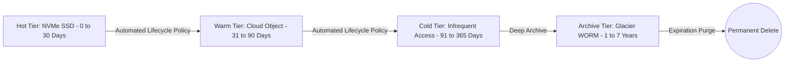

# Retention Estimation & Tiered Storage Architecture

## 1. Principles of Data Retention
In production enterprise architectures, storing all data indefinitely on primary operational datastores is technically unsustainable and financially irresponsible. Data retention estimation models the legal, regulatory, and business utility of information over time, structuring storage into automated hot, warm, cold, and archival tiers.

---

## 2. Regulatory & Compliance Retention Drivers

| Regulatory Standard | Mandate Scope | Required Retention Duration | Storage Durability & Integrity Requirement |
| :--- | :--- | :--- | :--- |
| **SEC Rule 17a-4 / FINRA** | Financial transactions, broker communications | 6 – 7 Years | Cryptographic WORM (Write-Once-Read-Many), tamper-proof audit logs. |
| **HIPAA** | Patient medical records and access logs | 6 Years | Encrypted at rest (AES-256), immutable audit trail. |
| **PCI-DSS (v4.0)** | Security logs, firewall audits, authorization events | 1 Year (Min 90 days hot) | Immediate availability for 90 days; historical offline audit for 1 year. |
| **GDPR (Article 17)** | European personal data ("Right to be Forgotten") | Strict Deletion on Request | Permanent physical or cryptographic erasure within 30 days. |

---

## 3. Mathematical Sizing Model for Tiered Retention

### Total Multi-Tier Storage Volume
$$V_{\text{total}} = V_{\text{hot}} + V_{\text{warm}} + V_{\text{cold}} + V_{\text{archive}}$$
$$V_{\text{tier}} = \text{Daily Ingestion} \times T_{\text{tier\_days}} \times \text{Compaction Ratio}_{\text{tier}} \times \text{RF}_{\text{tier}}$$

### Worked Sizing: Global Payment Gateway Logs
* **Daily Ingestion**: $5\text{ TB/day}$ of uncompressed transaction logs.
* **Tier 1 (Hot - Elasticsearch / OpenSearch)**: 30 days retention for real-time fraud analysis. (Compression $1.2\times$, Index overhead $+30\%$, $\text{RF} = 2$).
* **Tier 2 (Cold - S3 Standard / Parquet)**: 335 days retention (completes Year 1). (Compressed into Parquet $5\times$).
* **Tier 3 (Compliance Archive - Glacier Deep Archive WORM)**: 6 years retention (Years 2 through 7). (Compressed $5\times$).

#### Calculations:
* **Hot Tier**:
  $$V_{\text{hot}} = (5\text{ TB} \times 30\text{ days}) \times 1.30 \times 2 = 390\text{ TB on NVMe SSD}$$
* **Cold Tier (Year 1 Remaining)**:
  $$V_{\text{cold}} = (5\text{ TB} \times 335\text{ days}) \times 0.20 \approx 335\text{ TB on Object Storage}$$
* **Archive Tier (6 Years Compliance)**:
  $$V_{\text{archive}} = (5\text{ TB} \times 365 \times 6) \times 0.20 \approx 2,190\text{ TB} \approx 2.19\text{ PB}$$

---

## 4. Operational Gotchas: Tombstones & Compaction Overhead
* **Cassandra/NoSQL Tombstone Saturation**: In LSM-tree datastores, deleting expired data by writing tombstones degrades read latency. If millions of records expire simultaneously via TTL, read queries scan millions of tombstones, triggering `TombstoneOverwhelmingException`.
* **PostgreSQL MVCC Table Bloat**: Deleting millions of expired rows leaves dead tuples. The autovacuum daemon must be tuned with aggressive worker allocations to reclaim disk pages before table bloat consumes storage headroom.
