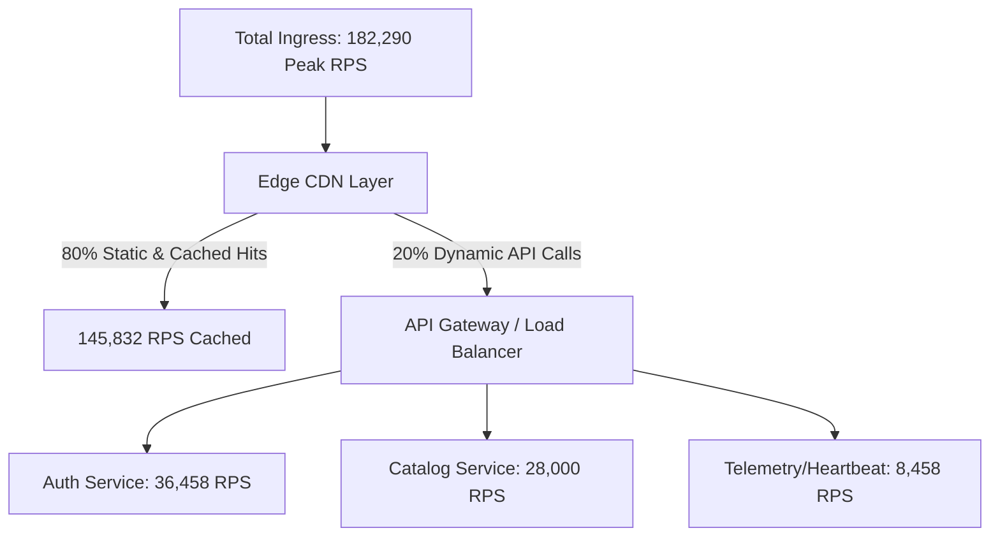

# Traffic Estimation

## 1. Concept & Scope
Traffic estimation is the foundational calculation that models how end users and external systems generate volume against an application. It bridges marketing and business metrics (DAU, MAU, session frequency) into concrete network traffic vectors.

---

## 2. Core Sizing Formulas

### User Activity Ratio
$$\text{Stickiness Ratio} = \frac{\text{DAU}}{\text{MAU}}$$
* *Consumer Apps (WhatsApp, TikTok)*: $0.50\text{--}0.70$ (Highly sticky)
* *B2B Enterprise SaaS*: $0.20\text{--}0.40$ (Weekday heavy)
* *E-commerce*: $0.05\text{--}0.15$ (Spiky, event-driven)

### Daily Request Volume
$$\text{Daily Requests } (Q_{\text{day}}) = \text{DAU} \times S \times R_s$$
Where:
* $S$ = Average sessions per user per day
* $R_s$ = Average requests per session

### Traffic Conversion to Base RPS
$$\text{RPS}_{\text{avg}} = \frac{Q_{\text{day}}}{86,400}$$

---

## 3. Worked Enterprise Example: Global Video Streaming Service

### Assumptions
* **Active Users**: $50\text{ Million DAU}$.
* **User Behavior**: Each user opens the app 3 times per day ($S = 3$).
* **Session Profile**: Per session, user executes:
  * 10 catalog search / browse requests
  * 2 video stream initialization calls
  * 30 heartbeat / progress tracking pings (1 every 60s during a 30-min view)
  * Total requests per session $R_s = 42$.

### Calculation
$$Q_{\text{day}} = 50,000,000 \times 3 \times 42 = 6,300,000,000\text{ requests/day} \quad (6.3\text{ Billion})$$
$$\text{RPS}_{\text{avg}} = \frac{6,300,000,000}{86,400} \approx 72,916\text{ RPS}$$

With a standard evening diurnal peak multiplier ($\text{PAR} = 2.5$):
$$\text{RPS}_{\text{peak}} = 72,916 \times 2.5 = 182,290\text{ RPS}$$

---

## 4. Traffic Breakdown by Component Layer

---

## 5. Architectural Implications & Trade-offs
* **Origin Offloading**: At $180\text{k RPS}$, routing all traffic directly to origin compute clusters requires massive horizontal fleets. Deploying an aggressive CDN edge caching tier absorbs $80\%\text{--}90\%$ of catalog reads, protecting origin databases.
* **Amplification at Microservice Boundaries**: A single edge request often fans out into $N$ internal gRPC calls. If 1 edge request triggers 4 internal RPC calls, the internal service mesh must be sized for:
  $$\text{Internal Mesh RPS} = 182,290 \times 4 = 729,160\text{ RPS}$$
* **Geographic Diurnal Distribution**: Global services observe traveling peaks (Asia $\rightarrow$ EMEA $\rightarrow$ Americas). Dynamic cross-region traffic balancing can smooth out aggregate global peak compute demands.
