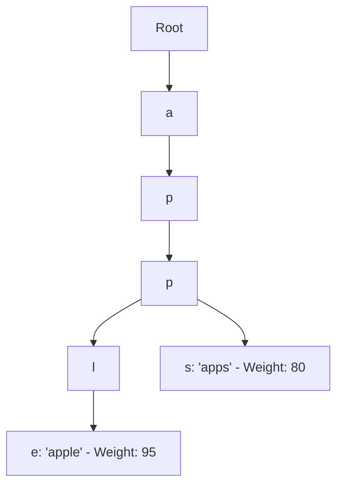

# Autocomplete Architecture (Trie Data Structure)

## 1. Prefix Trees (Tries)
Autocomplete prefix searches utilize a Trie where every tree node represents a character:

* **Time Complexity**: Finding top suggestions takes $O(K)$ where $K$ is the prefix length, independent of total catalog size.
