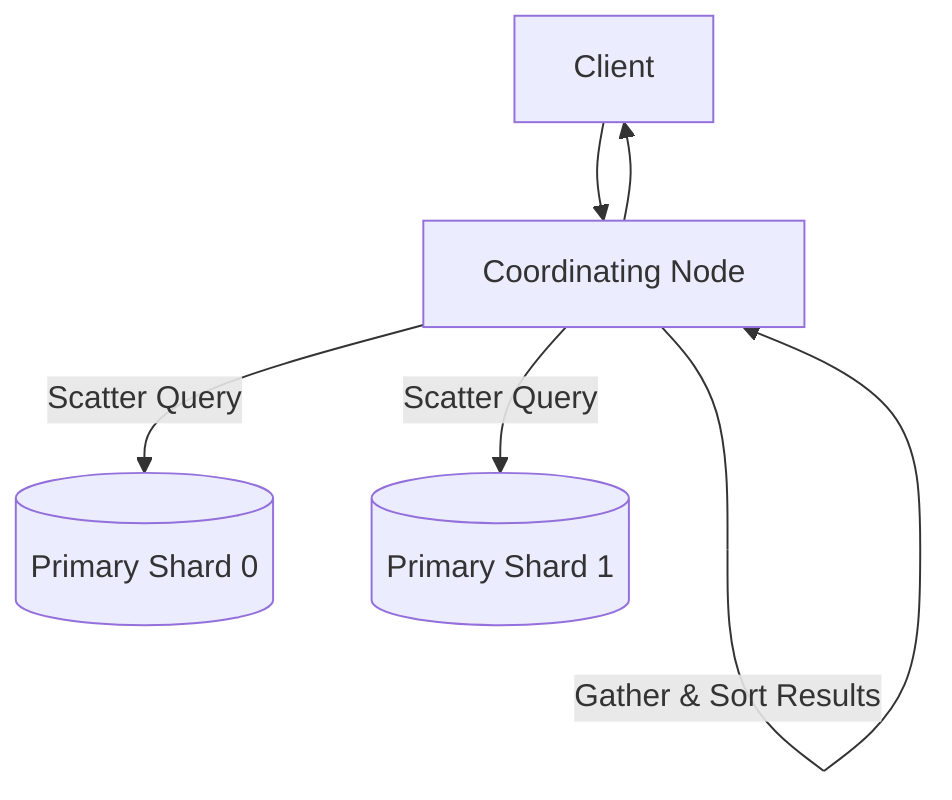

# Elasticsearch Cluster Architecture

## 1. Node Roles in Clustered Search
* **Master-Eligible Nodes**: Manages cluster state, shard allocation, and index mapping changes (3 nodes minimum for Raft quorum).
* **Data Nodes**: Stores Lucene index shards and executes disk I/O and query scoring.
* **Coordinating Nodes**: Stateless proxies that route client requests and execute scatter-gather query aggregation.

