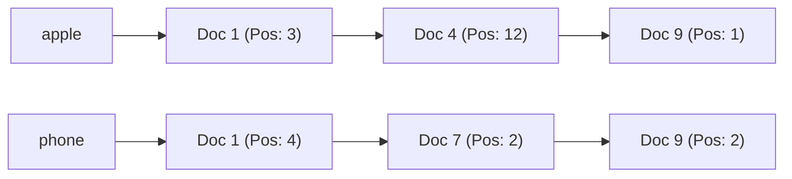

# Inverted Index Architecture

## 1. The Core Data Structure
An Inverted Index maps every unique word (term) in a corpus to a **Posting List** of document IDs where that word occurs:

---

## 2. Query Intersection ($O(A \cap B)$)
To execute `apple AND phone`:
* Intersect the posting list of `apple` with `phone`.
* Utilizing **Skip Lists** or **Roaring Bitmaps**, intersection evaluates in microsecond time without scanning document bodies.
