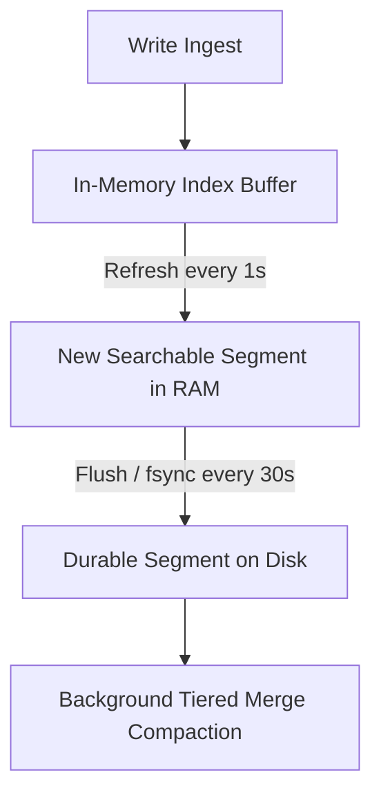

# Search Indexing & Lucene Segments

## 1. Near-Real-Time (NRT) Segment Architecture
Apache Lucene does not update disk files in place. It writes immutable **Segments**:

```mermaid
flowchart TD
    Ingest[Write Ingest] --> MemoryBuffer[In-Memory Index Buffer]
    MemoryBuffer -->|Refresh every 1s| SegmentNew[New Searchable Segment in RAM]
    SegmentNew -->|Flush / fsync every 30s| Disk[Durable Segment on Disk]
    Disk --> Compaction[Background Tiered Merge Compaction]
```
