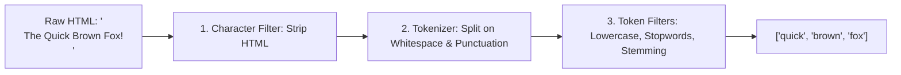

# Tokenization & Text Analysis Pipeline

## 1. The Analyzer Pipeline
Before text is added to the inverted index, it passes through three stages:

```mermaid
flowchart LR
    Raw[Raw HTML: '<p>The Quick Brown Fox!</p>'] --> CharFilter[1. Character Filter: Strip HTML]
    CharFilter --> Tokenizer[2. Tokenizer: Split on Whitespace & Punctuation]
    Tokenizer --> TokenFilter[3. Token Filters: Lowercase, Stopwords, Stemming]
    TokenFilter --> Terms["['quick', 'brown', 'fox']"]
```
