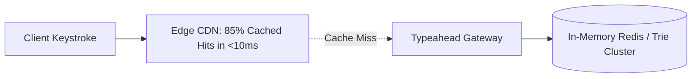

# Distributed Typeahead System Architecture

## 1. Sizing Typeahead at Scale (Google / Amazon Style)
With $100\text{ Million}$ daily searchers, each keystroke triggers an API call ($5\text{--}10\text{ keystrokes per query} = \mathbf{50,000\text{ RPS}}$).

