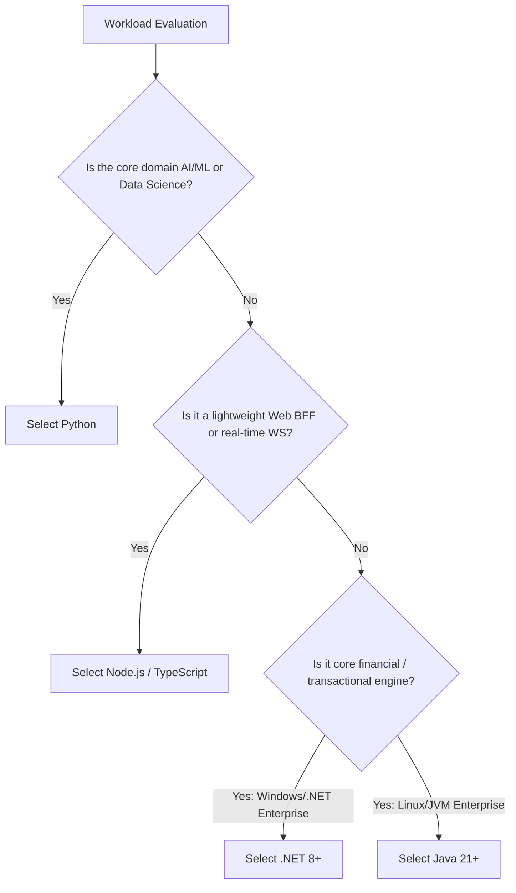

# Enterprise Technology Evaluation: Java vs Python: Enterprise Architecture Evaluation

## 1. Executive Trade-Off Summary
Contrasting strict JVM typing and Spring ecosystems against Python's agility, rich data science libraries, and lightweight FastAPI services.

> [!NOTE]
> **No Dogmatic Winners**: The evaluation below is grounded in enterprise fitness-for-purpose, total cost of ownership, and team cognitive load.

---

## 2. Multi-Dimensional Evaluation Matrix

```
+--------------------------+---------------------------------+---------------------------------+
| Evaluation Criterion     | Option A                        | Option B                        |
+--------------------------+---------------------------------+---------------------------------+
| Workload Suitability     | High-throughput transactional   | Rapid prototyping / data-rich   |
| Performance & Latency    | Low P99, multi-core throughput  | Excellent for I/O, bounded CPU  |
| Ecosystem & Libraries    | Massive enterprise ecosystem    | Dominant in specialized domain  |
| Scalability Model        | Horizontal + vertical multi-core| Horizontal cluster scaling      |
| Maintainability (Large)  | High (Compiler-checked types)   | High if strict types enforced   |
| Operational Maturity     | World-class profiling (JFR/Perf)| Lightweight container footprints|
| Hiring & Talent Pool     | Abundant senior talent          | Broad developer availability    |
| Infrastructure TCO       | Low memory/CPU consumption      | Highly cost-effective scaling   |
+--------------------------+---------------------------------+---------------------------------+
```

---

## 3. Decision Framework for Enterprise Architects


