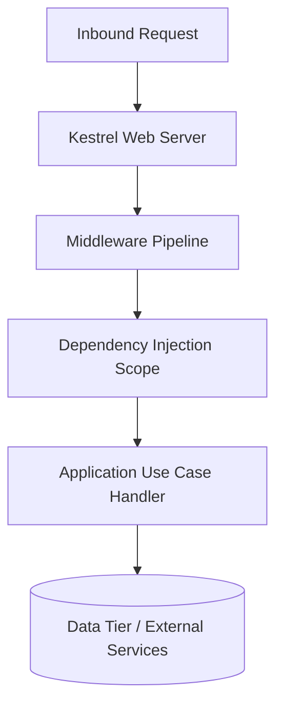

# .NET Enterprise Architecture: MVC Architectural Style in .NET

## 1. Architectural Purpose & Problem Context
When MVC controller abstractions provide value and when they introduce unnecessary bloat.

---

## 2. Runtime Mechanics & Structural Blueprint

---

## 3. Production Patterns & Anti-Patterns

### Recommended Architecture Practice:
- Encapsulate runtime mechanics behind abstractions.
- Enforce strict service lifetimes in dependency injection (Transient vs Scoped vs Singleton) to eliminate memory leaks and captive dependencies.

### Common Failure Modes:
- **Captive Dependency**: Injecting a `Scoped` service into a `Singleton` service, causing stale state and concurrency deadlocks.
- **Sync-over-Async (`.Result`)**: Blocking on asynchronous tasks, causing ThreadPool exhaustion under heavy traffic spikes.

---

## 4. Performance, Observability & Security Guardrails
- Track allocation rates and Garbage Collection Gen 2 collections.
- Propagate distributed trace context via `ActivitySource` and `Activity` (OpenTelemetry standard).
- Validate all incoming payloads before dispatching to application handlers.
