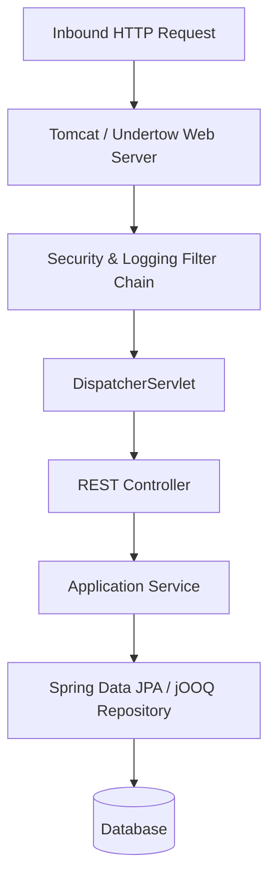

# Java Enterprise Architecture: High-Throughput Serialization

## 1. Architectural Purpose & Problem Context
Jackson afterburner/blackbird, Protobuf serialization, and record mapping.

---

## 2. Runtime Mechanics & Structural Blueprint

---

## 3. Production Patterns & Anti-Patterns

### Recommended Architecture Practice:
- Encapsulate domain rules in pure Java objects free of Spring annotations.
- Leverage Java records for immutable DTOs and value objects.
- Structure transaction boundaries explicitly via `@Transactional(readOnly = true)` for read queries.

### Common Failure Modes:
- **Hibernate N+1 Query Problem**: Executing 1 query for a parent list and $N$ individual queries for child collections due to lazy loading.
- **Thread Pool Pinning**: Executing synchronized blocking operations inside Virtual Threads, pinning carrier threads.

---

## 4. Performance, Observability & Security Guardrails
- Use Micrometer and OpenTelemetry for metrics and distributed tracing.
- Tune JVM memory flags (`-XX:+UseZGC`, `-XX:+UseStringDeduplication`).
- Enforce strict input validation via Jakarta Validation (`@Valid`, `@NotNull`).
