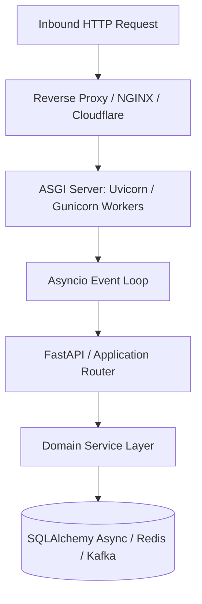

# Python Enterprise Architecture: Python Architecture Overview

## 1. Architectural Purpose & Problem Context
CPython runtime model, bytecode execution, GIL implications, and when Python fits enterprise workloads.

---

## 2. Runtime Mechanics & Structural Blueprint

---

## 3. Production Patterns & Anti-Patterns

### Recommended Architecture Practice:
- Use type annotations rigorously with Pydantic v2 to enforce domain models and boundary schemas.
- Offload CPU-bound calculations to background Celery workers or multiprocessing pools to avoid blocking the single-threaded asyncio event loop.
- Decouple business logic from web frameworks (FastAPI/Django) using Clean or Hexagonal architecture.

### Common Failure Modes:
- **Event Loop Starvation**: Running synchronous blocking calls (e.g., `requests.get()` or `time.sleep()`) inside `async def` route handlers, blocking all concurrent user requests on that worker.
- **Memory Bloat**: Accumulating large dictionaries or un-pruned object graphs in long-running processes, causing Linux OOM killer termination.

---

## 4. Performance, Observability & Security Guardrails
- Profile with `py-spy` and memory-profile with `tracemalloc`.
- Implement OpenTelemetry tracing with auto-instrumentation for FastAPI and SQLAlchemy.
- Enforce boundary validation via Pydantic; prevent SQL injection via SQLAlchemy parameterized queries.
