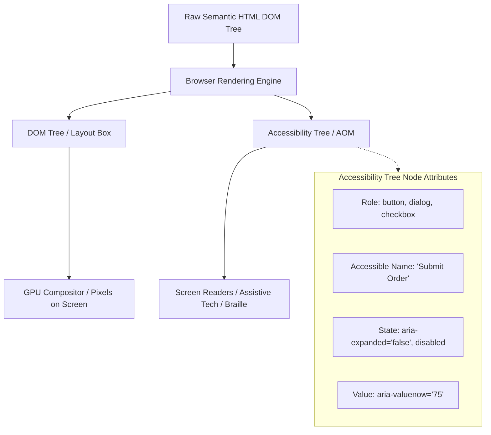
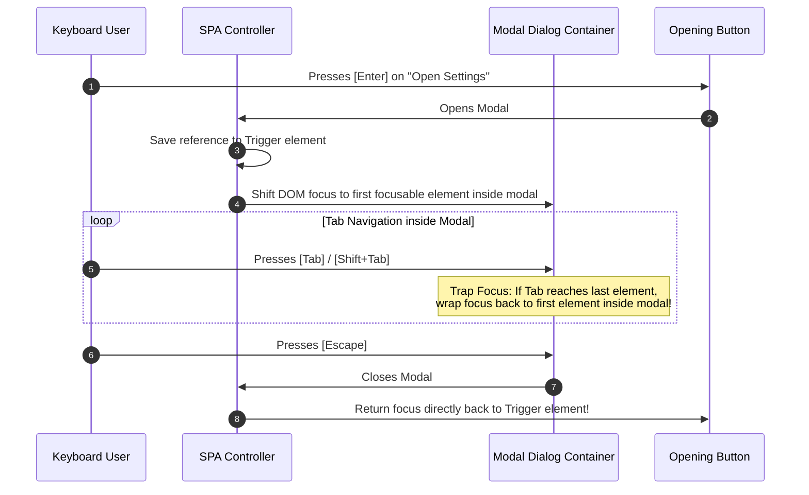

# Frontend Accessibility Architecture: WCAG 2.2, AOM, and Shift-Left Testing

## 1. Architectural Overview & Context
**Web Accessibility (a11y)** is the architectural discipline of designing digital user interfaces that can be perceived, navigated, understood, and operated by all users, including individuals with visual, auditory, motor, speech, or cognitive disabilities.

In modern enterprise software, accessibility is not an aesthetic polish or a retrofitted patch:
> **Accessibility is a mandatory architectural Non-Functional Requirement (NFR), legal compliance mandate (ADA Title III, Section 508, European Accessibility Act), and core usability pillar.**

```
┌─────────────────────────────────────────────────────────────────────────────┐
│                       THE POUR ACCESSIBILITY PILLARS                        │
├─────────────────────┬───────────────────────────────────────────────────────┤
│ 1. Perceivable      │ Information must be presentable in multiple sensory   │
│                     │ modalities (text alternatives, captions, contrast).   │
├─────────────────────┼───────────────────────────────────────────────────────┤
│ 2. Operable         │ Interface components and navigation must be operable  │
│                     │ via keyboard alone (no mouse required, focus rings).  │
├─────────────────────┼───────────────────────────────────────────────────────┤
│ 3. Understandable   │ Information and operation must be clear, predictable, │
│                     │ with structured error identification and prevention.  │
├─────────────────────┼───────────────────────────────────────────────────────┤
│ 4. Robust           │ Content must be interpretable reliably by assistive   │
│                     │ technologies (screen readers, braille displays).      │
└─────────────────────┴───────────────────────────────────────────────────────┘
```

---

## 2. The Browser Accessibility Tree (AOM)

Assistive technologies (screen readers like NVDA, JAWS, VoiceOver) do not parse visual pixels; they query the browser's **Accessibility Tree**:



### The First Rule of ARIA:
> *"If you can use a native HTML element or attribute with the semantics and behavior you require already built in, then do so instead of re-purposing an element and adding an ARIA role."* — W3C WAI

Using native `<button>` provides built-in keyboard focus (`Tab`), activation (`Enter`, `Space`), and screen-reader role semantics for free. Replacing it with `<div onClick={...}>` introduces an accessibility defect that requires manual ARIA and keyboard handling.

---

## 3. Focus Management & Keyboard Trap Prevention

For interactive single-page application (SPA) architectures (modals, dialogs, drawers, dropdowns):



---

## 4. Architectural Contrast, Scaling & ARIA Live Regions

| Quality Attribute | WCAG 2.2 AA Standard | Architectural Design System Requirement |
|---|---|---|
| **Text Contrast Ratio** | Minimum $4.5:1$ for normal text; $3:1$ for large text | Design token palette must enforce mathematically validated contrast pairings. |
| **Non-Text Contrast** | Minimum $3:1$ for UI controls, borders, focus indicators | Focus outlines must use high-contrast color ($>3:1$) and minimum 2px thickness. |
| **Text Resizing** | Content must scale up to $200\%$ without loss of content | Use relative units (`rem`, `em`, `ch`) rather than fixed pixels (`px`) for typography. |
| **Dynamic Notifications** | Async background updates announced to screen readers | Wrap toast/snackbars in `aria-live="polite"` (or `assertive` for critical errors). |

---

## 5. Shift-Left Accessibility Testing in CI/CD

Preventing accessibility regressions requires automated verification at every pipeline stage:

```
Developer Workstation                Pull Request CI/CD                    Production Staging
┌───────────────────────────────┐    ┌───────────────────────────────┐    ┌───────────────────────────────┐
│ IDE Linters (eslint-plugin-   │    │ Headless axe-core Playwright  │    │ Scheduled Full Site Crawls    │
│ jsx-a11y) catches missing     │───►│ Automated a11y assertions     │───►│ Manual Assistive Tech Audits  │
│ alt tags & invalid ARIA roles │    │ block merges on violations    │    │ with NVDA / VoiceOver         │
└───────────────────────────────┘    └───────────────────────────────┘    └───────────────────────────────┘
```

### Automated Playwright + axe-core Test Example:
```typescript
import { test, expect } from '@playwright/test';
import AxeBuilder from '@axe-core/playwright';

test('Checkout page must have zero automated accessibility violations', async ({ page }) => {
  await page.goto('/checkout');
  
  const accessibilityScanResults = await new AxeBuilder({ page })
    .withTags(['wcag2a', 'wcag2aa', 'wcag22aa'])
    .analyze();

  expect(accessibilityScanResults.violations).toEqual([]);
});
```

---

## 6. Frontend Accessibility Architectural Checklist
- [ ] Enforce WCAG 2.2 AA compliance as a formal gate in Definition of Done.
- [ ] Prioritize semantic HTML elements (`<button>`, `<dialog>`, `<nav>`, `<main>`) over ARIA div soup.
- [ ] Implement focus trapping and restoration on all dialogs, drawers, and popovers.
- [ ] Validate that all interactive controls are fully operable via keyboard alone (`Tab`, `Enter`, `Space`, `Esc`).
- [ ] Design token palettes mathematically verified for minimum $4.5:1$ contrast.
- [ ] Integrate `@axe-core/playwright` automated assertions into continuous integration pipelines.

---

## 7. Related Modules
* [04-frontend/design-systems/](../design-systems/README.md) — Multi-brand design systems, tokens, and accessible component libraries.
* [16-architecture-deliverables/](../../16-architecture-deliverables/) — Non-Functional Requirement (NFR) templates and acceptance criteria.
* [04-frontend/typescript/](../typescript/README.md) — Strong typing for design tokens and component props.
