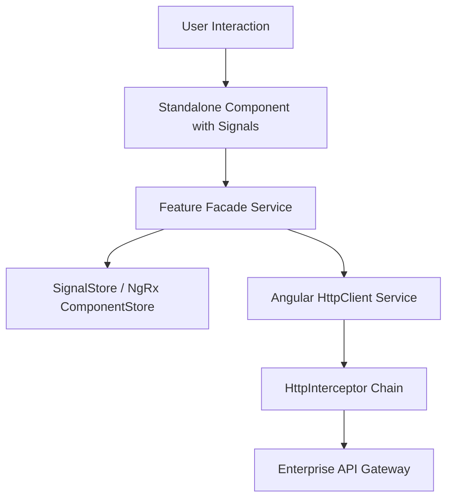

# Angular Architecture: Standalone Components Architecture

## 1. Architectural Purpose & Problem Context
Direct imports, simplified dependency trees, and tree-shakable component libraries.

---

## 2. Structural Blueprint & Component Lifecycle

---

## 3. Production Patterns & Anti-Patterns

### Recommended Architecture Practice:
- Adopt modern Standalone Components and Signals for fine-grained reactivity without Zone.js overhead.
- Use Feature Facade services to decouple components from complex RxJS / NgRx state stores.

### Common Failure Modes:
- **RxJS Memory Leaks**: Subscribing to Observables inside components without `takeUntilDestroyed()` or async pipe, leaking component instances in memory.
- **Overusing NgRx Global Store**: Storing trivial local UI state in complex global Redux actions and reducers.
