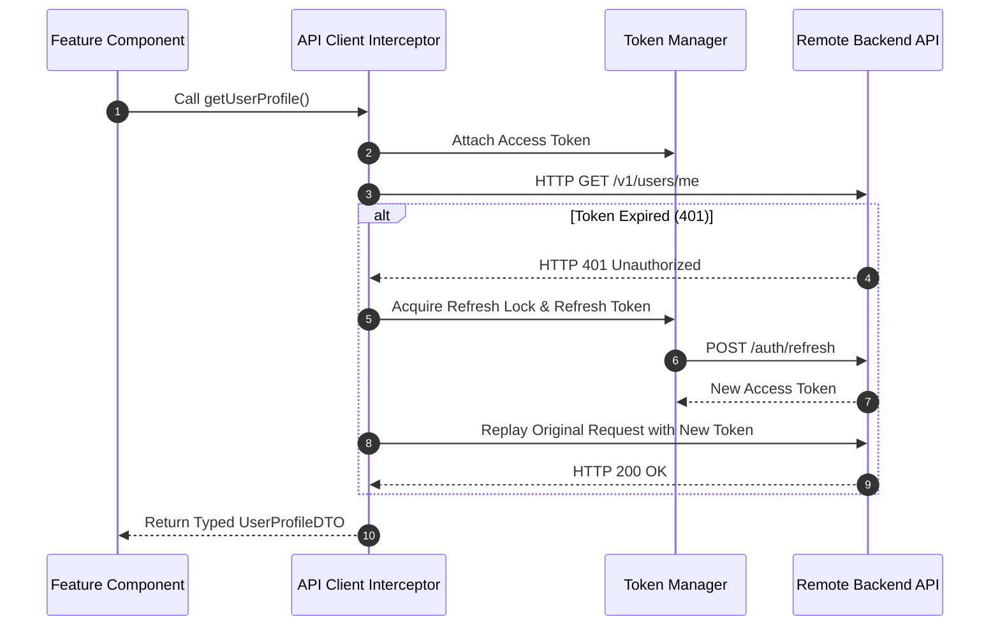

# API Client Architecture: Client Error Handling & Problem Details

## 1. Architectural Purpose & Problem Context
Translating RFC 7807 problem details into user-friendly localized UI error messages.

---

## 2. Structural Workflow

---

## 3. Production Invariants
- Use a distributed mutex / single-flight promise during token refresh so 20 concurrent requests do not trigger 20 refresh calls.
- Never retry non-idempotent POST mutations automatically without an `Idempotency-Key`.
