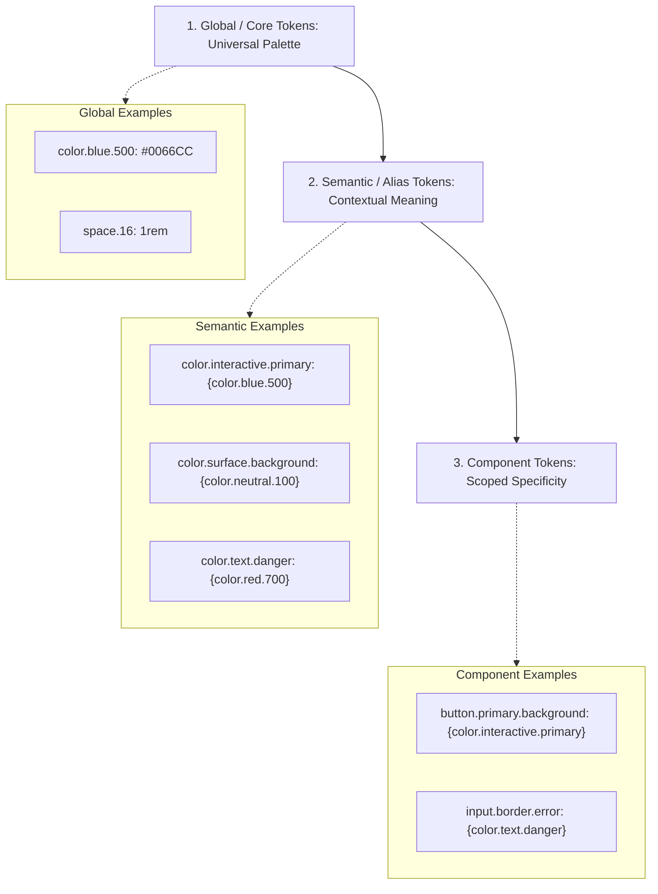

# Design Systems Architecture: Tokens, Headless Primitives, and Multi-Brand Theming

## 1. Architectural Overview & Context
An **Enterprise Design System** is the single source of visual truth, component implementations, and design token contracts that unifies user experience across web applications, mobile platforms, and customer touchpoints.

In large organizations with dozens of autonomous engineering squads, the absence of a design system leads to visual fragmentation, duplicate wheel-reinvention, and massive technical debt. Conversely, a rigid, monolithic UI library slows down squads and fails across different brands.

```
┌─────────────────────────────────────────────────────────────────────────────┐
│                   ENTERPRISE DESIGN SYSTEM LAYERS                           │
├─────────────────────┬───────────────────────────────────────────────────────┤
│ 1. Design Tokens    │ Raw design decisions (Colors, Spacing, Typography)    │
│ 2. Headless Layer   │ Behavioral state & a11y primitives (Radix, React Aria)│
│ 3. Styled Component │ Brand-specific implementations (Buttons, Modals, Forms│
│ 4. Pattern Library  │ Composed enterprise flows (Address Form, Order Cart)  │
└─────────────────────┴───────────────────────────────────────────────────────┘
```

---

## 2. Multi-Tier Design Token Architecture (W3C Standard)

Design tokens bridge the gap between Figma design tooling and production code. Following the W3C Design Tokens Community Group specification, tokens are structured in three hierarchical tiers:



### Multi-Brand & Dark Mode Transformation
Because semantic tokens point to global tokens, swapping a theme or brand requires swapping only the alias token definitions at the root DOM level via CSS Custom Properties:
```css
/* Brand A (Blue Enterprise) */
[data-theme="brand-a"] {
  --color-interactive-primary: #0052cc;
  --color-surface-bg: #ffffff;
}

/* Brand B (Fintech Emerald Dark) */
[data-theme="brand-b-dark"] {
  --color-interactive-primary: #00c853;
  --color-surface-bg: #121212;
}
```

---

## 3. Headless vs. Styled Architecture

```
Tightly-Coupled Monolithic Library               Modern Headless + Styled Architecture
┌───────────────────────────────────────┐         ┌───────────────────────────────────────┐
│ Rigid CSS + JS Bundle                 │         │ Headless Primitive (State + A11y)     │
│ Hard-coded styling assumptions        │  ──►───►│   │ Radix UI / React Aria / Ark UI    │
│ Difficult to theme across brands      │         │   ▼                                   │
│ Massive bundle size overhead          │         │ Zero-Runtime CSS (Tailwind / Vanilla) │
└───────────────────────────────────────┘         └───────────────────────────────────────┘
```

| Dimension | Monolithic Styled Library (e.g. legacy MUI) | Headless UI Architecture (e.g. Radix / React Aria) |
|---|---|---|
| **Accessibility** | Pre-packaged, but hard to customize | Exceptional (Unopinionated ARIA, focus trapping built-in) |
| **Styling Freedom** | Low (Fight against CSS overrides / specificity) | Absolute (Squad owns styling via CSS Modules or Vanilla CSS) |
| **Framework Agnostic** | Framework-specific (React only) | Often multi-framework (React, Vue, Svelte, Solid) |
| **Bundle Footprint** | Large (Includes bundled styling engine) | Minimal (Near zero CSS overhead) |

---

## 4. Design System Monorepo Governance

```
design-system/
├── packages/
│   ├── tokens/            # Style Dictionary build pipeline (exports JSON, CSS, TS, iOS, Android)
│   ├── core-react/        # Accessible React component implementations
│   ├── core-webcomponents/# Framework-agnostic Web Components (Lit)
│   └── icons/             # Optimized SVG asset pipeline
├── apps/
│   ├── storybook/         # Living component catalog & documentation
│   └── visual-regression/ # Chromatic / Playwright automated screenshot tests
```

### Semantic Versioning & Breaking Change Management
* **Patch (`1.2.1`)**: Internal bug fixes, accessibility enhancements without API change.
* **Minor (`1.3.0`)**: Backwards-compatible new components, new token definitions.
* **Major (`2.0.0`)**: Breaking prop renames, token deprecations, or DOM hierarchy alterations.
* **Codemod Automation**: For major releases, the design system team must provide automated AST transformation scripts (`jscodeshift`) to migrate consumer repositories automatically.

---

## 5. Micro-Frontend Style Isolation

When multiple micro-frontends coexist on a single page, conflicting CSS rules can destroy layout:
1. **CSS Custom Properties Scoping**: Scope variables to local root containers (`.mfe-checkout { ... }`).
2. **Shadow DOM Encapsulation**: Utilize Web Components and Shadow DOM for total stylesheet boundary isolation.
3. **CSS-in-JS Scoped Hashes**: Use scoped classname generators (e.g., `button_btn_x9a2b`).

---

## 6. Design Systems Architectural Checklist
- [ ] Adopt a 3-tier design token hierarchy (Global $\rightarrow$ Semantic $\rightarrow$ Component).
- [ ] Build upon headless accessibility primitives (Radix, React Aria) rather than raw HTML `<div>`s.
- [ ] Implement automated Style Dictionary transforms targeting Web (CSS/TS), iOS (Swift), and Android (Kotlin).
- [ ] Enforce automated visual regression testing (Percy, Chromatic, Playwright) on pull requests.
- [ ] Provide automated codemods for breaking major version upgrades.
- [ ] Verify WCAG 2.2 AA contrast compliance across all brand and color-mode permutations.

---

## 7. Related Modules
* [04-frontend/accessibility/](../accessibility/README.md) — Screen reader trees, focus trapping, and WCAG standards.
* [04-frontend/micro-frontends/](../micro-frontends/README.md) — Style isolation and module federation across teams.
* [04-frontend/typescript/](../typescript/README.md) — Strongly-typed token contracts and component interfaces.
