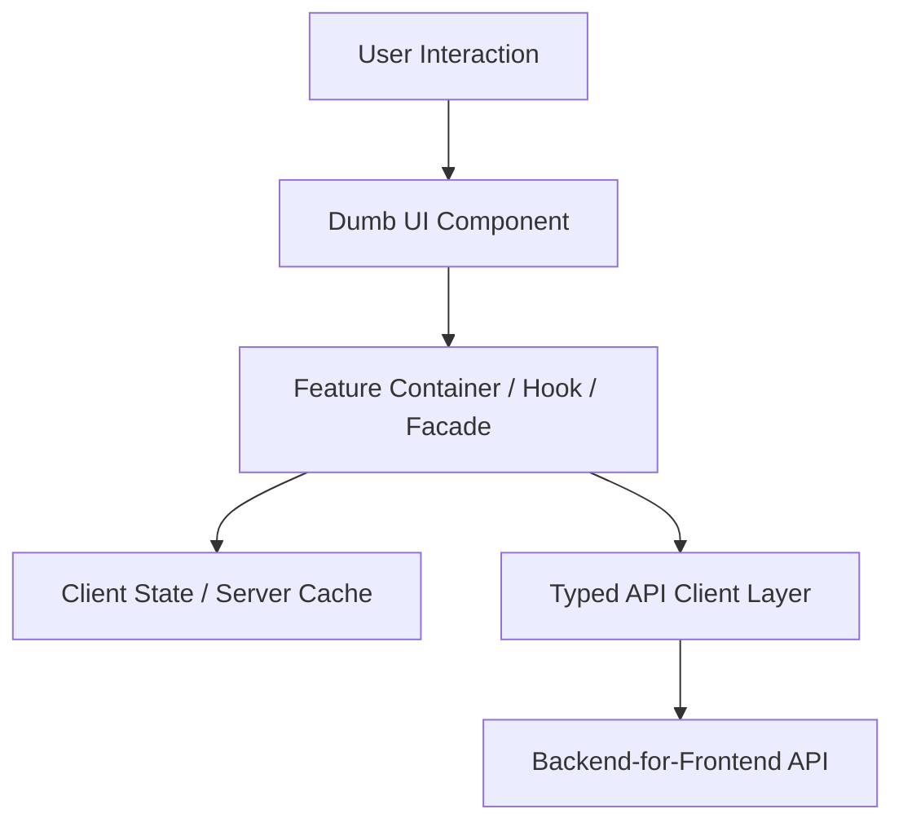

# Frontend Architecture: Design Systems Architecture

## 1. Architectural Purpose & Problem Context
Design tokens, atomic component libraries, headless UI patterns, and versioning shared design components.

---

## 2. Structural Blueprint & Component Boundaries

---

## 3. Production Guidelines & Trade-Offs
- **Keep Components Presentation-Only**: UI components should accept props/inputs and emit events. Business calculations belong in pure domain hooks or services.
- **Isolate Server State**: Never mirror backend API responses into manual global Redux/NgRx stores. Use dedicated server caching libraries (TanStack Query).
