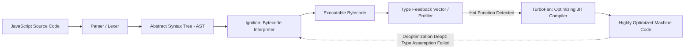
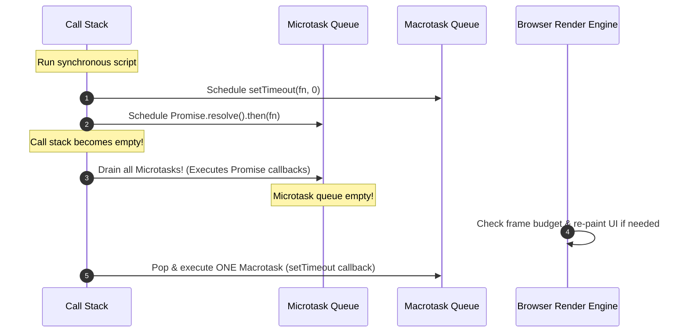

# Architectural JavaScript: Runtimes, Memory, and Asynchronous Concurrency

## 1. Architectural Overview & Context
For software architects, JavaScript is not merely a scripting language for DOM manipulation; it is a **ubiquitous distributed runtime** executing in web browsers, mobile webviews, edge workers (Cloudflare Workers, V8 isolates), and backend server environments (Node.js, Deno, Bun).

Architecting performant, resilient JavaScript applications requires understanding how the V8 engine compiles code, manages the event loop, allocates heap memory, and resolves module boundaries.

---

## 2. The V8 Engine Pipeline & JIT Compilation

The V8 engine transforms human-readable JavaScript into optimized native machine code through a multi-tier compilation pipeline:



### Architectural Implications for Performance:
* **Monomorphism vs. Polymorphism**: TurboFan generates optimized assembly based on the *shape* of objects (hidden classes). Passing objects with inconsistent properties de-optimizes the function, dropping execution back to slower interpreted bytecode.
* **Warm-up Tax**: Serverless environments (cold starts) pay an interpreted compilation tax on initialization before JIT optimization takes effect.

---

## 3. The JavaScript Event Loop & Task Queues

JavaScript operates on a single-threaded execution model backed by non-blocking I/O event loops:

```
┌─────────────────────────────────────────────────────────────────────────────┐
│                       THE BROWSER EVENT LOOP CYCLE                          │
├─────────────────────────────────────────────────────────────────────────────┤
│ 1. Call Stack: Executes synchronous JavaScript frames until empty           │
│ 2. Microtask Queue: Drains ALL pending microtasks (Promise.then,            │
│    queueMicrotask, MutationObserver) until empty!                           │
│ 3. Animation Frame: requestAnimationFrame callbacks executed before paint   │
│ 4. Render / Paint: Recalculate styles, layout, and composite GPU layers     │
│ 5. Macrotask Queue: Executes EXACTLY ONE macrotask (setTimeout, setInterval,│
│    I/O, message events), then loops back to step 1!                         │
└─────────────────────────────────────────────────────────────────────────────┘
```



> **Critical Architecture Rule**: Long-running synchronous loops or recursive microtasks starve the render engine and macrotask queue, completely freezing the user interface. Heavy CPU computation (cryptography, large dataset sorting) must be offloaded to **Web Workers**.

---

## 4. Memory Architecture & Leak Mitigation

JavaScript employs automated Garbage Collection (Mark-and-Sweep via Generational GC: New Space / Scavenger vs. Old Space / Major Mark-Sweep-Compact).

### The 4 Major JavaScript Memory Leaks:
```
┌───────────────────────────────────────┐         ┌───────────────────────────────────────┐
│ 1. Detached DOM Nodes                 │         │ 2. Forgotten Timers & Callbacks       │
│ Removed from DOM tree but retained    │         │ setInterval referencing stale state   │
│ by JavaScript variable reference.     │         │ keeps entire scope alive in memory.   │
├───────────────────────────────────────┤         ├───────────────────────────────────────┤
│ 3. Unbounded Closures                 │         │ 4. Global Event Listeners             │
│ Outer function scope captured by inner│         │ window.addEventListener('resize')     │
│ callback and never released.          │         │ never cleaned up on component unmount.│
└───────────────────────────────────────┘         └───────────────────────────────────────┘
```

### Memory Profiling Architecture:
* In CI/CD, execute automated memory leak detection using Playwright and Chrome DevTools Protocol (CDP) by checking heap snapshot size before and after mounting/unmounting key views.

---

## 5. Module Systems: ESM vs. CommonJS

The JavaScript ecosystem has completed its migration to standard **ECMAScript Modules (ESM)**:

| Architectural Dimension | CommonJS (CJS) | ECMAScript Modules (ESM) |
|---|---|---|
| **Loading Model** | Synchronous, dynamic (`require()`) | Asynchronous, static (`import ... from`) |
| **Parsing & Evaluation** | Evaluated during runtime execution | Parsed and resolved statically before evaluation |
| **Tree-Shaking Support**| Poor (Dynamic imports prevent dead-code elimination) | Exceptional (Static AST allows bundlers to drop unused exports) |
| **Environment** | Classic Node.js (`.cjs`) | Browsers, Edge Workers, Modern Node.js (`"type": "module"`) |

---

## 6. Architectural JavaScript Checklist
- [ ] Enforce native ECMAScript Modules (ESM) across all enterprise libraries and services.
- [ ] Offload long-running CPU calculations ($> 16\text{ms}$) to dedicated Web Workers to protect 60fps UI rendering.
- [ ] Implement explicit teardown/cleanup logic for all global event listeners and timers upon view unmount.
- [ ] Avoid polymorphic object shapes in hot execution loops to maintain JIT optimization.
- [ ] Configure tree-shaking and automated bundle analysis in CI/CD to prevent dependency bloat.
- [ ] Enforce automated lockfile auditing (`npm audit`, Socket.dev) to prevent supply-chain malware injection.

---

## 7. Related Modules
* [04-frontend/typescript/](../typescript/README.md) — Structural typing, compilation pipelines, and API schemas.
* [04-frontend/micro-frontends/](../micro-frontends/README.md) — Runtime module federation and shared dependency trees.
* [00-foundations/operating-systems/](../../00-foundations/operating-systems/README.md) — Non-blocking I/O and process concurrency.
