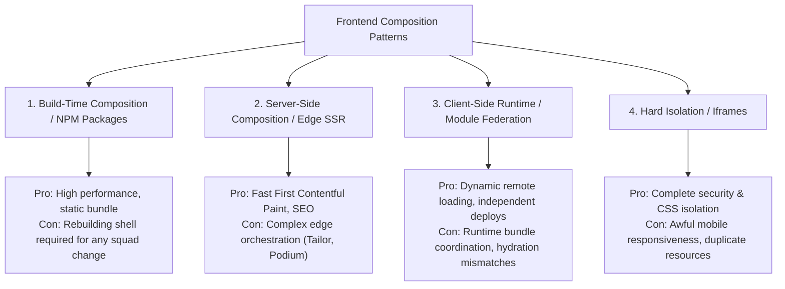
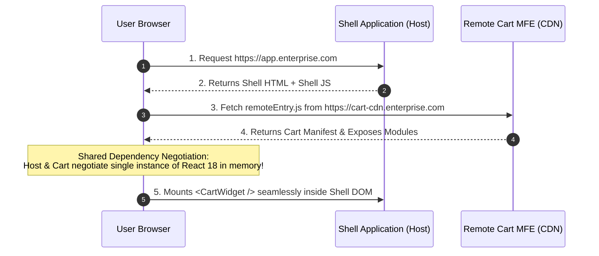

# Micro-Frontend Architecture: Composition, Module Federation, and Organizational Scaling

## 1. Architectural Overview & Context
**Micro-Frontend (MFE) Architecture** is an architectural and organizational pattern in which a single web application frontend is decomposed into autonomous, independently deliverable, and loosely coupled frontend applications owned by distinct domain teams.

A foundational architectural reality must be stated upfront:
> **Micro-frontends do NOT reduce technical complexity; they increase it. Micro-frontends solve ORGANIZATIONAL and TEAM SCALING problems at the expense of runtime complexity, performance overhead, and integration risk.**

```
Monolithic Frontend (Single Codebase, Single Deploy)
┌─────────────────────────────────────────────────────────────┐
│  Search Team  │  Cart Team  │  Checkout Team  │ Admin Team  │
│  All teams commit to 1 git repo; deployment requires all    │
│  teams to coordinate; 1 team bug blocks entire deployment   │
└─────────────────────────────────────────────────────────────┘
                               ▲
                               │ Conway's Law Transformation
                               ▼
Micro-Frontend Architecture (Autonomous Repos & Deployments)
┌──────────────┐  ┌──────────────┐  ┌──────────────┐  ┌──────────────┐
│ MFE: Search  │  │  MFE: Cart   │  │MFE: Checkout │  │ MFE: Account │
│ Team Search  │  │  Team Cart   │  │Team Checkout │  │ Team Account │
│ Independent  │  │ Independent  │  │ Independent  │  │ Independent  │
│ Deploy (v1.4)│  │ Deploy (v2.1)│  │ Deploy (v1.0)│  │ Deploy (v3.0)│
└──────┬───────┘  └──────┬───────┘  └──────┬───────┘  └──────┬───────┘
       │                 │                 │                 │
       └─────────────────┴────────┬────────┴─────────────────┘
                                  ▼
                     [Runtime Shell / Host App]
```

---

## 2. When to Use vs. When NOT to Use Micro-Frontends

| Context | Micro-Frontend Fit | Monolithic Frontend Fit |
|---|---|---|
| **Organization Scale** | $> 30 - 50$ frontend engineers across $5+$ independent product squads | $< 30$ frontend engineers |
| **Release Cadence** | Squads require independent release cycles without coordinating deployments | Single unified release schedule |
| **Technology Diversity** | Coexistence required during multi-year framework migration (Angular $\rightarrow$ React) | Single unified framework stack |
| **Performance Budget** | Can afford $+150\text{KB} - 300\text{KB}$ overhead for module federation runtimes | Strict Core Web Vitals budgets (LCP $< 1.5\text{s}$) |
| **Team Isolation** | Teams have distinct business metrics (e.g. Catalog vs Checkout vs Account) | Features are tightly interconnected |

---

## 3. Composition Patterns Compared



---

## 4. Modern Standard: Webpack 5 / Vite Module Federation

**Module Federation** enables a host container to dynamically import compiled JavaScript bundles from remote origins at runtime while sharing common dependencies (e.g. single instance of React):



### Webpack Module Federation Configuration Example:
```javascript
// shell/webpack.config.js (Host)
new ModuleFederationPlugin({
  name: 'shell_app',
  remotes: {
    cart_mfe: 'cart_mfe@https://cdn.enterprise.com/cart/remoteEntry.js',
    checkout_mfe: 'checkout_mfe@https://cdn.enterprise.com/checkout/remoteEntry.js',
  },
  shared: {
    react: { singleton: true, requiredVersion: '^18.2.0', eager: false },
    'react-dom': { singleton: true, requiredVersion: '^18.2.0', eager: false },
  },
});
```

---

## 5. Inter-MFE Communication Architecture

Direct tight-coupling between MFEs (e.g. importing components across MFEs) destroys autonomy. Use an **asynchronous event bus**:

```
┌─────────────────────────────────────────────────────────────┐
│                    INTER-MFE COMMUNICATION                  │
├─────────────────────┬───────────────────────────────────────┤
│ Standard DOM Custom │ window.dispatchEvent(new CustomEvent( │
│ Events (Preferred)  │   'mfe:cart:updated', {detail: {items}}))│
├─────────────────────┼───────────────────────────────────────┤
│ URL Query Params    │ State reflected in browser URL:       │
│ & History API       │ /checkout?orderId=123 (Zero coupling) │
├─────────────────────┼───────────────────────────────────────┤
│ Shared Global Store │ Anti-Pattern! Sharing single Redux    │
│ (Forbidden)         │ store tightly couples MFE state types │
└─────────────────────┴───────────────────────────────────────┘
```

---

## 6. Micro-Frontend Architectural Checklist
- [ ] Justify MFE adoption on organizational Conway's Law grounds, not technical fashion.
- [ ] Enforce singleton shared dependencies (`react`, `design-tokens`) to prevent multi-megabyte bundle bloat.
- [ ] Isolate CSS styles using CSS Modules, Shadow DOM, or strict prefix scoping (`.mfe-cart-*`).
- [ ] Standardize inter-MFE communication exclusively via CustomEvents or URL parameters.
- [ ] Provide a local mock container so squad developers can build without running all other MFEs.
- [ ] Implement end-to-end synthetic monitoring across the integrated host container.

---

## 7. Related Modules
* [04-frontend/design-systems/](../design-systems/README.md) — Shared token layers and style encapsulation.
* [04-frontend/javascript/](../javascript/README.md) — ESM module resolution and runtime event loop mechanics.
* [16-architecture-deliverables/](../../16-architecture-deliverables/) — Architecture Decision Records for team boundaries.
