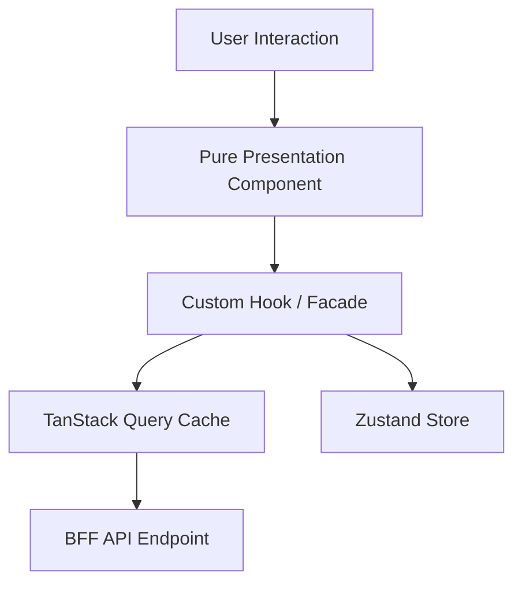

# React Architecture: Component Architecture & Presentational/Container Split

## 1. Architectural Purpose & Problem Context
Presentational (dumb) vs Container (smart) components, compound components, and render props.

---

## 2. Structural Blueprint & Component Lifecycle

---

## 3. Production Patterns & Anti-Patterns

### Recommended Architecture Practice:
- Separate pure UI components (stateless rendering) from container hooks (orchestrating state and data fetching).
- Use React Server Components (RSC) to execute database queries and heavy dependencies on the server, sending zero JavaScript to the client.

### Common Failure Modes:
- **Prop Drilling & God Components**: Passing props through 15 levels of components; creating 1,200-line components that mix JSX, data fetching, and business logic.
- **Uncontrolled Re-render Cascades**: Storing high-frequency state (e.g., scroll position) in top-level context, causing the entire DOM tree to re-render.
