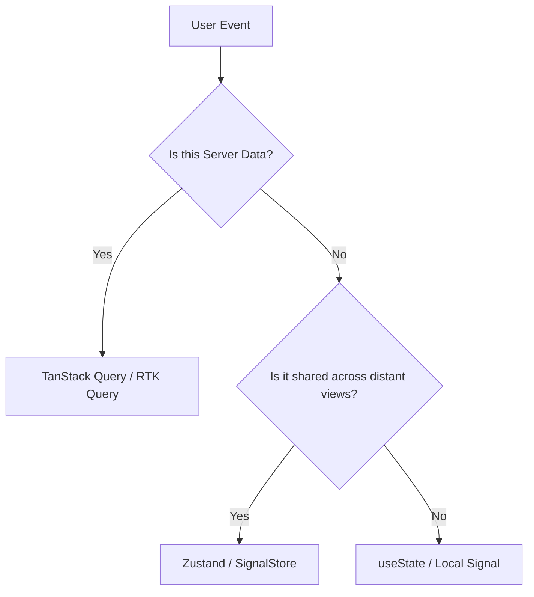

# Frontend State: Offline-First State & Synchronization

## 1. Architectural Purpose & Problem Context
CRDTs, local SQLite/IndexedDB stores, and conflict resolution during network reconnection.

---

## 2. Structural Architecture & Data Flow

---

## 3. Production Guidelines & Anti-Patterns
- **The Golden Rule**: Never duplicate server cache data into a client global store (Redux).
- Avoid impossible UI states (e.g., status flags without state machines) by using explicit status enums.
