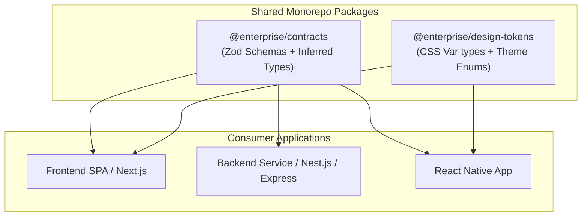

# Enterprise TypeScript Architecture: Contracts, Boundaries, and Runtime Validation

## 1. Architectural Overview & Context
TypeScript has evolved from a developer-ergonomics tool into a primary **architectural contract framework** for large-scale enterprise applications.

A common misunderstanding in enterprise engineering is treating TypeScript as a guarantee of runtime safety.
> **The Fundamental Law of TypeScript Architecture**:
> *TypeScript types exist purely at compile-time and are completely erased during compilation. They protect internal developer refactoring, but provide ZERO runtime protection against untrusted external inputs (API payloads, local storage, URL params).*

```
┌───────────────────────────────────────┐         ┌───────────────────────────────────────┐
│     EXTERNAL UNTRUSTED PERIMETER      │         │      INTERNAL APPLICATION DOMAIN      │
├───────────────────────────────────────┤         ├───────────────────────────────────────┤
│ REST API Payloads (JSON over HTTP)    │         │ Strongly Typed Domain Entities        │
│ LocalStorage / IndexedDB caches       │ ──ZOD──►│ Guaranteed Invariant Rules            │
│ URL Search Parameters / Hash          │  PARSE  │ Branded Types (CustomerId vs OrderId) │
│ User Form Inputs                      │         │ Type-safe Business Logic Pipelines    │
└───────────────────────────────────────┘         └───────────────────────────────────────┘
```

---

## 2. Structural Typing vs. Nominal Branded Types

TypeScript uses a **structural type system** (duck typing): if two types have the same shape, they are interchangeable. In enterprise domain modeling, this leads to catastrophic bugs:

```typescript
// ❌ Dangerous Structural Equivalence
type CustomerId = string;
type OrderId = string;

function cancelOrder(orderId: OrderId, customerId: CustomerId) { /* ... */ }

const customerId: CustomerId = "cust_123";
const orderId: OrderId = "ord_999";

// Compiles with ZERO errors because both are just string!
cancelOrder(customerId, orderId); 
```

### The Architectural Solution: Nominal Branded Types
By attaching a phantom unique brand, architects enforce compile-time distinction:

```typescript
// ✅ Safe Nominal Branded Types
declare const Brand: unique symbol;
export type Brand<T, B> = T & { readonly [Brand]: B };

export type CustomerId = Brand<string, "CustomerId">;
export type OrderId = Brand<string, "OrderId">;

// Constructor helper
export const CustomerId = (id: string) => id as CustomerId;
export const OrderId = (id: string) => id as OrderId;

// Now this generates a COMPILE ERROR:
// cancelOrder(customerId, orderId); // Error: Type 'CustomerId' is not assignable to 'OrderId'
```

---

## 3. The Runtime Validation Bridge: Zod Schema Contracts

To bridge external untrusted JSON payloads to internal TypeScript types, architects mandate **Schema Validation Libraries** (Zod / Valibot):

```typescript
import { z } from 'zod';

// 1. Define single source of truth schema
export const OrderPayloadSchema = z.object({
  orderId: z.string().uuid(),
  totalAmountCents: z.number().int().nonnegative(),
  currency: z.enum(['USD', 'EUR', 'GBP']),
  items: z.array(z.object({
    sku: z.string().min(3),
    quantity: z.number().int().positive(),
  })).min(1),
});

// 2. Derive TypeScript type automatically (Zero duplicate interfaces!)
export type OrderPayload = z.infer<typeof OrderPayloadSchema>;

// 3. Ingress validation boundary
export function handleIncomingOrder(rawPayload: unknown): OrderPayload {
  const result = OrderPayloadSchema.safeParse(rawPayload);
  if (!result.success) {
    throw new Error(`Contract Violation: ${result.error.message}`);
  }
  return result.data; // Safely typed OrderPayload!
}
```

---

## 4. Enterprise Monorepo Type Sharing Topology



### Golden Rules for Monorepo Shared Types:
1. **Never export internal database entities directly to frontend packages**: Always export explicit Data Transfer Object (DTO) contracts to prevent leaking internal database schemas.
2. **Publish compiled `.d.ts` declaration files**: Do not force consumers to transpile raw `.ts` files from external packages.

---

## 5. Architectural Strictness Standards (`tsconfig.json`)

To prevent teams from bypassing the type system with `any`:

```json
{
  "compilerOptions": {
    "strict": true,
    "noImplicitAny": true,
    "strictNullChecks": true,
    "strictFunctionTypes": true,
    "strictBindCallApply": true,
    "strictPropertyInitialization": true,
    "noImplicitThis": true,
    "alwaysStrict": true,
    "noUncheckedIndexedAccess": true,
    "exactOptionalPropertyTypes": true,
    "noFallthroughCasesInSwitch": true,
    "forceConsistentCasingInFileNames": true
  }
}
```

---

## 6. Enterprise TypeScript Architectural Checklist
- [ ] Enable `strict: true` and `noUncheckedIndexedAccess: true` in all project `tsconfig.json` files.
- [ ] Enforce runtime schema validation (Zod) at all external API and storage boundaries.
- [ ] Derive static TypeScript interfaces from Zod schemas via `z.infer<T>` to eliminate type divergence.
- [ ] Implement nominal branded types for entity identifiers (`UserId`, `AccountId`) to prevent accidental inversion.
- [ ] Ban `any` in ESLint configurations (`@typescript-eslint/no-explicit-any: error`); require `unknown` with type guards.
- [ ] Maintain an isolated `@enterprise/contracts` package in monorepos for shared API schemas.

---

## 7. Related Modules
* [04-frontend/javascript/](../javascript/README.md) — JavaScript runtime engine, V8 optimization, and memory management.
* [04-frontend/design-systems/](../design-systems/README.md) — Design token type definitions and component APIs.
* [07-integration/rest/](../../07-integration/rest/) — OpenAPI specification and schema generation.
