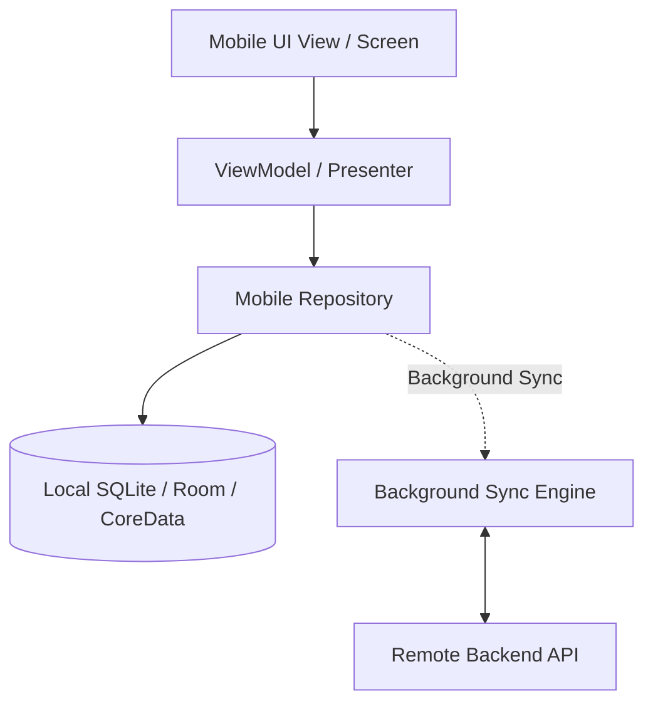

# Mobile Architecture: Offline-First Mobile Architecture

## 1. Architectural Purpose & Problem Context
Treating the local device database as the authoritative source of truth; network as a background sync pipe.

---

## 2. Structural Architecture & Offline Data Flow

---

## 3. Production Guidelines & Anti-Patterns
- **Never Execute I/O on the Main Thread**: Database queries or network calls on the main thread cause dropped frames and OS-triggered ANR crashes.
- **Biometric Security**: Never store raw biometric data; use OS Secure Enclave / Keymaster to decrypt master JWT refresh tokens.
