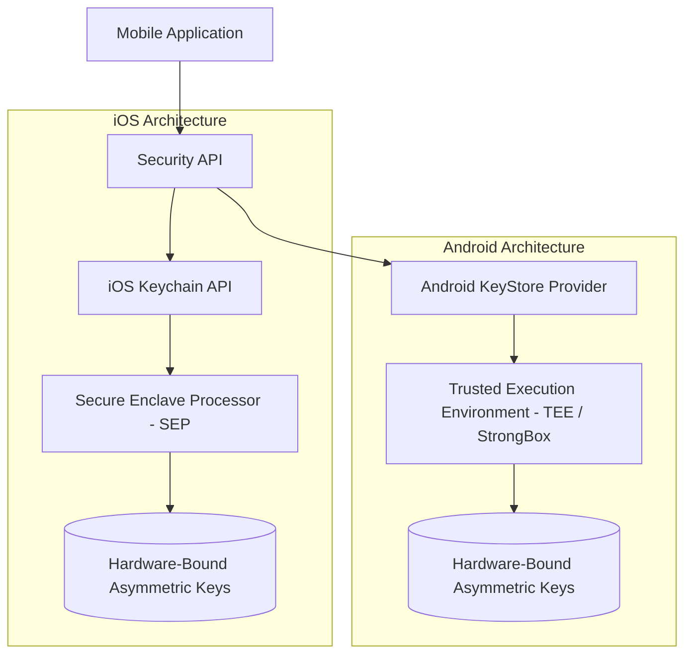
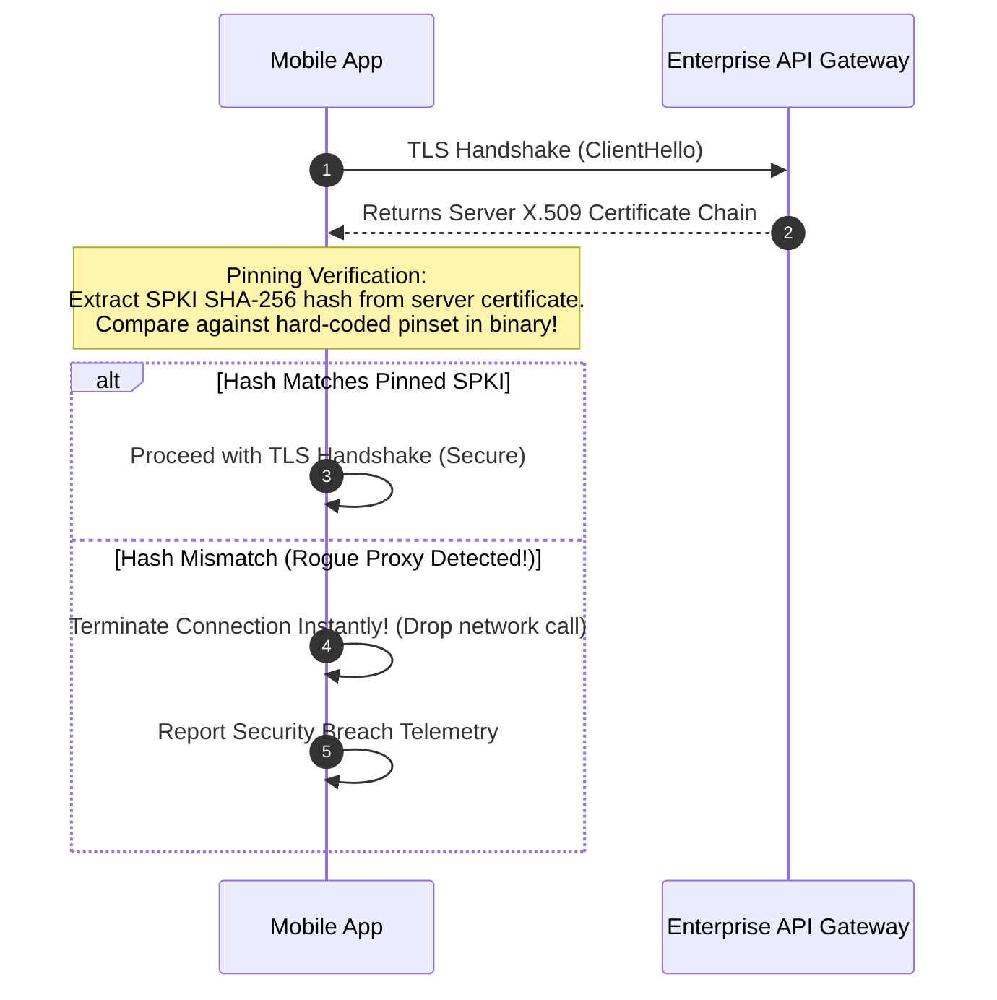

# Mobile Security Architecture: Keychain/KeyStore, Biometrics, and Pinning

## 1. Architectural Overview & The Mobile Threat Model
Mobile applications execute on untrusted, consumer-controlled hardware in hostile physical and network environments. 

The traditional server-side security assumption ("the client environment is secure") does not hold on mobile devices:
> **The Mobile Security Reality**:
> *Adversaries can physically inspect device memory, hook running processes via Frida, decompile application binaries, intercept network traffic via custom CA proxy certificates, and run apps on compromised (rooted/jailbroken) operating systems.*

```
┌─────────────────────────────────────────────────────────────────────────────┐
│                         MOBILE ATTACK SURFACES                              │
├─────────────────────┬───────────────────────────────────────────────────────┤
│ 1. Device Storage   │ Unencrypted SQLite databases, SharedPreferences, plist│
│ 2. Network Transit  │ Man-in-the-Middle (MitM) via rogue Wi-Fi or proxy cert│
│ 3. Runtime Memory   │ Memory scraping, runtime method swizzling (Frida)     │
│ 4. Binary Integrity │ Reverse engineering, APK repackaging, signature bypass│
│ 5. OS Compromise    │ Jailbroken iOS / Rooted Android disabling sandbox     │
└─────────────────────┴───────────────────────────────────────────────────────┘
```

---

## 2. Hardware-Backed Secure Storage

Never store sensitive credentials, tokens, or encryption keys in plaintext files (`AsyncStorage`, `SharedPreferences`, `UserDefaults`). Mobile architects mandate **Hardware-Backed Cryptographic Stores**:



### Access Control Flags:
* **iOS**: Configure `kSecAccessControlBiometryAny` or `kSecAttrAccessibleAfterFirstUnlockThisDeviceOnly` (prevents keys from being migrated to other devices via iCloud backups).
* **Android**: Use `MasterKey.Builder` with `KeyGenParameterSpec` requiring user authentication (`setUserAuthenticationRequired(true)`).

---

## 3. Biometric Authentication Architecture

Biometrics (FaceID, TouchID, Android BiometricPrompt) must **never** be used as a simple boolean flag returned to application logic (which can be easily bypassed via runtime hooking):

```
❌ Insecure Biometric Pattern (Client-Side Boolean):
if (BiometricAuth.authenticate() == true) {
    navigate("/account-balance"); // Easily bypassed with 1 line of Frida script!
}

✅ Secure Biometric Architecture (Cryptographic Gating):
1. Key is generated inside the Secure Enclave / KeyStore.
2. Key requires biometric authentication to unlock the private key.
3. App signs an ephemeral server challenge nonce using the unlocked hardware key.
4. Server verifies signature before releasing sensitive account data!
```

---

## 4. Network Security: TLS Certificate Pinning

By default, mobile operating systems trust hundreds of public Certificate Authorities (CAs). If a corporate network, foreign government, or local proxy installs a rogue root CA on the user's device, they can intercept and decrypt all HTTPS traffic.

### Certificate Pinning Architecture:
The mobile client hard-codes the cryptographic hash of the server's public key (Subject Public Key Information - SPKI SHA-256):



### Pin Rotation & Disaster Prevention:
* **Always pin to the public key (SPKI)**, not the certificate itself (allows renewing certificates without updating the pin).
* **Always include a minimum of two pins**: One active primary pin and one offline backup disaster recovery pin.

---

## 5. Reverse Engineering & Jailbreak Defense (RASP)

**Runtime Application Self-Protection (RASP)** techniques provide layered defense against automated reverse engineering:

```
┌─────────────────────────────────────────────────────────────┐
│                          RASP DEFENSIVE CONTROLS            │
├─────────────────────┬───────────────────────────────────────┤
│ 1. Jailbreak / Root │ Detect su binaries, Cydia, Magisk,    │
│    Detection        │ read-only filesystem modifications    │
├─────────────────────┼───────────────────────────────────────┤
│ 2. Debugger Defense │ ptrace(PT_DENY_ATTACH), detect lldb   │
│                     │ and GDB hooks upon startup            │
├─────────────────────┼───────────────────────────────────────┤
│ 3. Memory Swizzling │ Detect Frida / Substrate injection    │
│    Detection        │ by scanning `/proc/self/maps`         │
├─────────────────────┼───────────────────────────────────────┤
│ 4. Snapshot Blurring│ Obscure app switcher preview snapshot │
│    & Anti-Snoop     │ when app transitions to background    │
└─────────────────────┴───────────────────────────────────────┘
```

---

## 6. Mobile Security Architectural Checklist
- [ ] Store all tokens and keys in the hardware-backed iOS Keychain or Android KeyStore.
- [ ] Bind biometric authentication to cryptographic hardware key release rather than UI boolean checks.
- [ ] Enforce TLS Certificate Pinning with backup SPKI pins on all production API endpoints.
- [ ] Obscure application UI in the OS app switcher (preventing snapshot PII leakage).
- [ ] Disable clipboard pasteboard caching for sensitive payment or password fields.
- [ ] Encrypt all local databases (SQLite) using SQLCipher with keys derived from KeyStore/Keychain.

---

## 7. Related Modules
* [00-foundations/security/](../../00-foundations/security/README.md) — Cryptographic primitives and TLS 1.3 handshakes.
* [05-mobile/offline-first/](../offline-first/README.md) — Local database encryption and offline token storage.
* [10-security/](../../10-security/) — Enterprise threat modeling, API gateway auth, and secret rotation.
