# Native Mobile Architecture: Platform Capabilities, Runtimes, and Cross-Platform Trade-offs

## 1. Architectural Overview & Context
Mobile application architecture requires selecting an execution runtime that balances native device performance, access to specialized hardware capabilities, cross-platform code sharing, and organizational engineering velocity.

The architectural decision between **Pure Native (Swift/Kotlin)** and **Cross-Platform (React Native, Flutter, Kotlin Multiplatform - KMP)** is not a cosmetic developer preference; it is a fundamental business trade-off between user experience perfection and engineering efficiency.

---

## 2. Mobile Execution Runtimes Compared

```mermaid
flowchart TD
    subgraph NativeModel["1. Pure Native (Swift / Kotlin)"]
        NCode[Swift / Kotlin Code] --> NCompiler[LLVM / Native Toolchain]
        NCompiler --> NBin[Direct ARM64 Machine Assembly]
        NBin <--> PlatformAPI1[Direct OS Platform APIs: CoreBluetooth, Metal]
    end

    subgraph FlutterModel["2. Flutter (Skia / Impeller Rendering Engine)"]
        FCode[Dart Code] --> AOT[AOT Native Compiler]
        AOT --> FBin[Native ARM64 Binary]
        FBin --> Impeller[Custom Graphics Engine: Impeller]
        FBin <-->|Platform Channels / FFI| PlatformAPI2[Platform APIs]
    end

    subgraph RNModel["3. React Native (Fabric & TurboModules / JSI)"]
        RNCode[JavaScript / TypeScript] --> Herm[Hermes JS Engine]
        Herm <-->|JSI C++ Direct Memory Invocation| HostObject[C++ TurboModules]
        HostObject <--> PlatformAPI3[Platform APIs]
    end
```



---

## 3. The Comprehensive Mobile Architecture Decision Matrix

| Dimension | Pure Native (Swift / Kotlin) | Flutter (Dart) | React Native (TypeScript / C++) | Kotlin Multiplatform (KMP) |
|---|---|---|---|---|
| **UI Rendering Model** | Native OS widgets (SwiftUI / Jetpack Compose) | Custom Skia/Impeller engine drawn directly on canvas | Native OS widgets wrapped via JSI host objects | Native UI (SwiftUI / Compose) with shared Kotlin logic |
| **Bridge Overhead** | **Zero**. Direct CPU register & memory access. | **Near Zero** for UI. Low for platform channels. | **Near Zero** with modern JSI (Hermes C++ pointers). | **Zero**. Compiles to Objective-C/Swift framework and Java bytecode. |
| **Startup Time (Cold)** | $< 100\text{ms}$ | $150\text{ms} - 300\text{ms}$ | $200\text{ms} - 500\text{ms}$ (Hermes bytecode pre-compilation) | $< 100\text{ms}$ |
| **Code Sharing %** | $0\%$ (Separate iOS/Android teams) | $85\% - 95\%$ (Single codebase) | $80\% - 90\%$ (Single codebase) | $60\% - 75\%$ (Shared business logic, native UI) |
| **Hardware Access** | Day-1 access to all new iOS/Android SDKs | Requires community or custom platform channel plugin | Requires community or custom TurboModule plugin | Direct native access via expect/actual declarations |
| **Ideal Architectural Fit** | High-performance 3D/AR, audio synthesis, system utilities | High-fidelity branded consumer apps with uniform UI | Content-driven, e-commerce, forms, enterprise portals | Complex enterprise apps with shared offline sync & business rules |

---

## 4. Background Execution Lifecycle & OS Power Constraints

Both iOS and Android enforce draconian operating system limits on background execution to preserve battery life:

```
┌─────────────────────────────────────────────────────────────────────────────┐
│                    MOBILE BACKGROUND EXECUTION CONTROLS                     │
├─────────────────────┬───────────────────────────────────────────────────────┤
│ iOS Background      │ BGAppRefreshTask, BGProcessingTask. OS decides when   │
│ Tasks API           │ to execute based on battery level and device usage!   │
├─────────────────────┼───────────────────────────────────────────────────────┤
│ Android WorkManager │ Guaranteed deferrable background work backed by       │
│ API                 │ JobScheduler; respects battery Doze Mode restrictions.│
├─────────────────────┼───────────────────────────────────────────────────────┤
│ Short-Lived Sockets │ App backgrounded $\rightarrow$ Socket closed after    │
│                     │ 30 seconds! Never rely on persistent background TCP.  │
└─────────────────────┴───────────────────────────────────────────────────────┘
```

### Architectural Mandate:
Background synchronization must be **chunked, idempotent, and state-checkpointed** so that if the OS abruptly terminates the process, the next wakeup resumes without data corruption.

---

## 5. Thread Management: Protecting the 60fps / 120fps UI Budget

Mobile displays refresh at **60Hz (16.6ms per frame)** or **120Hz ProMotion (8.3ms per frame)**.
* **The Golden Rule**: The Main / UI Thread must execute **ZERO disk I/O, database queries, image decompression, or JSON parsing**.
* **Swift**: Enforce Swift Concurrency (`@MainActor` for UI updates, `Task.detached` or background actors for processing).
* **Kotlin**: Enforce Coroutines (`Dispatchers.Main` for UI, `Dispatchers.IO` for database/network).

---

## 6. Native Mobile Architecture Checklist
- [ ] Choose runtime (Native vs React Native vs Flutter vs KMP) based on team topology and hardware requirements.
- [ ] Enforce asynchronous execution off the Main Thread for all database, file, and network operations.
- [ ] Architect background tasks using OS-standard schedulers (`WorkManager`, `BGTaskScheduler`).
- [ ] Implement automated performance benchmarks (Startup Time, Frame Drops, Memory Footprint) in mobile CI/CD.
- [ ] Provide explicit architectural boundaries between platform-specific code and shared business logic.

---

## 7. Related Modules
* [05-mobile/mobile-security/](../mobile-security/README.md) — Secure Enclave, KeyStore, and certificate pinning.
* [05-mobile/offline-first/](../offline-first/README.md) — Embedded SQLite datastores and sync engine architectures.
* [04-frontend/javascript/](../../04-frontend/javascript/README.md) — JavaScript engine internals and event loop mechanics.
