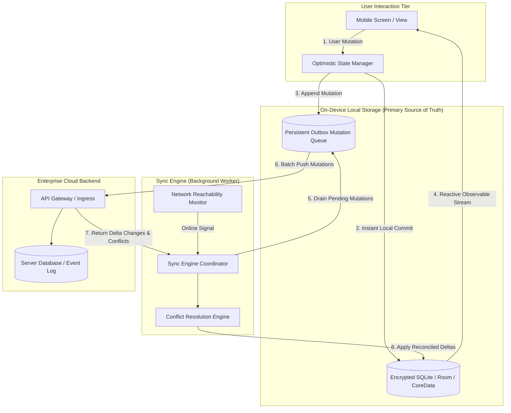

# Offline-First Mobile Architecture: Local Datastores, Sync Engines, and CRDTs

## 1. Architectural Overview & Context
An **Offline-First Mobile Architecture** treats local on-device storage as the primary source of truth for the user interface, treating the remote network not as a mandatory dependency, but as an asynchronous synchronization channel.

In high-reliability enterprise applications (field technician apps, logistics tracking, healthcare point-of-care, airline crew tablets), network connectivity is intermittent, slow, or completely absent. Designing apps that display a blocking spinner whenever network connectivity drops leads to catastrophic operational failure.

```
Online-First (Fragile, Blocking)                 Offline-First (Resilient, Instant)
┌───────────────────────────────────────┐         ┌───────────────────────────────────────┐
│ User Action                           │         │ User Action                           │
│   │                                   │         │   │                                   │
│   ▼                                   │         │   ▼                                   │
│ [Network HTTP Call] ──(Timeout?)──► 💥│         │ [Write to Local Encrypted SQLite]     │
│   │                                   │         │   ├── Update UI Instantly (0ms Latency│
│   ▼                                   │         │   └── Enqueue Mutation to Outbox Queue│
│ Update Local UI (Only if network OK)  │         │          │                            │
│                                       │         │          ▼                            │
│                                       │         │   [Background Sync Engine / WAN]      │
└───────────────────────────────────────┘         └───────────────────────────────────────┘
```

---

## 2. Offline-First Synchronization Architecture Blueprint



---

## 3. Bidirectional Sync & Conflict Resolution Strategies

When a record is modified on the mobile device while offline, and simultaneously modified on the server:

```
Device A (Offline)                      Server (Source of Record)             Device B (Online)
┌──────────────────────────────┐        ┌──────────────────────────────┐       ┌──────────────────────────────┐
│ t=1: Edit Order #101 Status: │        │ t=0: Order #101 Status: NEW  │       │ t=2: Edit Order #101 Status: │
│      SHIPPED                 │        │                              │◄──────│      CANCELLED               │
│                              │        │ t=2: Server updates to:      │       └──────────────────────────────┘
│                              │        │      CANCELLED               │
│ t=3: Device reconnects       │        │                              │
│      Pushes: SHIPPED ───────►│        │ CONFLICT DETECTED!           │
└──────────────────────────────┘        └──────────────────────────────┘
```

### The 4 Conflict Resolution Architectural Strategies:

| Strategy | Mechanism | Best Use Case | Risk / Drawback |
|---|---|---|---|
| **1. Server-Wins** | Server state unconditionally overwrites local client mutation. | Financial ledgers, security permission grants. | User frustration; silently discards local work. |
| **2. Last-Write-Wins (LWW)** | Winner determined by highest timestamp. | Non-critical status flags, simple fields. | Dangerous; vulnerable to device clock drift. |
| **3. CRDTs (Conflict-Free Replicated Data Types)** | Mathematically commutative structures converge deterministically without locks. | Collaborative notes, shopping carts, increment counters. | High memory overhead; requires specialized datatypes. |
| **4. Operational Break Workflow** | System flags conflict in a `NEEDS_REVIEW` state and presents a manual 3-way merge UI. | Clinical healthcare notes, legal contracts. | Requires human operational intervention. |

---

## 4. The Outbox Mutation Queue & Idempotency

To prevent data loss when the operating system abruptly kills the background synchronization worker:
* **Persistent SQLite Queue**: Mutations are stored in an append-only SQLite table with states: `PENDING` $\rightarrow$ `IN_FLIGHT` $\rightarrow$ `ACKNOWLEDGED`.
* **UUIDv5 Idempotency Key**: Every mutation generated on device carries a client-generated UUIDv5 key. If a network drop occurs during sync, the mobile client safely resubmits the batch without creating duplicate records on the server.

---

## 5. Battery, Bandwidth, and Delta Sync Optimization

* **Never Perform Full Table Dumps**: Synchronize only delta changes using a monotonically increasing server timestamp or logical clock (`WHERE server_updated_at > :last_sync_timestamp`).
* **Backpressure & Battery Awareness**: When device battery is $< 20\%$ or connected via metered cellular connection, throttle sync interval and defer binary attachment uploads (e.g. photos/PDFs) until Wi-Fi and charging are restored.

---

## 6. Offline-First Architectural Checklist
- [ ] Bind all UI components to local database observables (Room / CoreData / WatermelonDB).
- [ ] Implement optimistic UI updates with automatic rollback on fatal server rejection.
- [ ] Store offline mutations in a durable, persistent Outbox queue with deterministic UUIDv5 idempotency keys.
- [ ] Adopt Delta-Sync query mechanics to minimize cellular data transfer and battery consumption.
- [ ] Explicitly define a conflict resolution policy (Server-Wins vs CRDT vs Manual Review) for every data model.
- [ ] Encrypt all local databases with SQLCipher using keys retrieved from hardware Keychain/KeyStore.

---

## 7. Related Modules
* [05-mobile/mobile-security/](../mobile-security/README.md) — SQLCipher database encryption and Secure Enclave keys.
* [02-system-design/consistency/](../../02-system-design/consistency/README.md) — Eventual consistency, CRDTs, and distributed state.
* [14-enterprise-integration/reconciliation/](../../14-enterprise-integration/reconciliation/) — Financial break management and operational triage.
